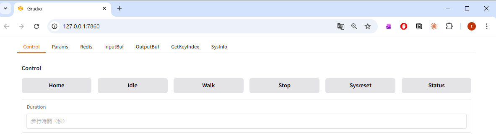
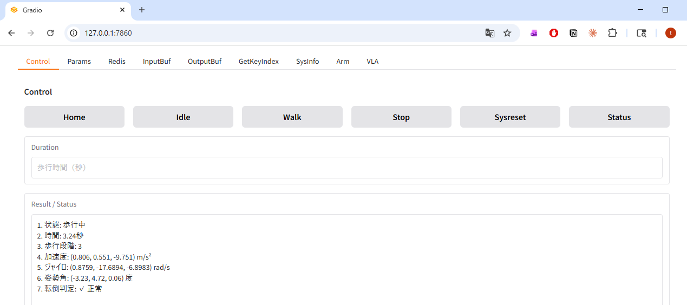
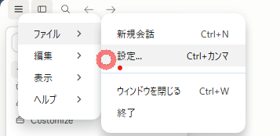
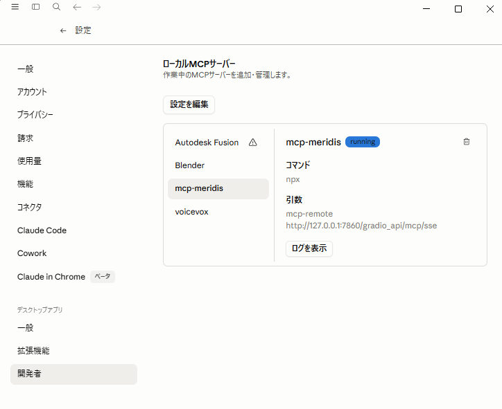
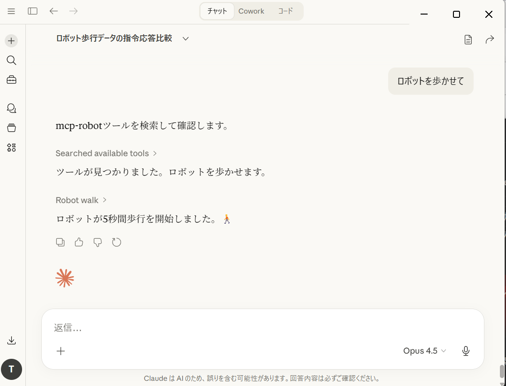
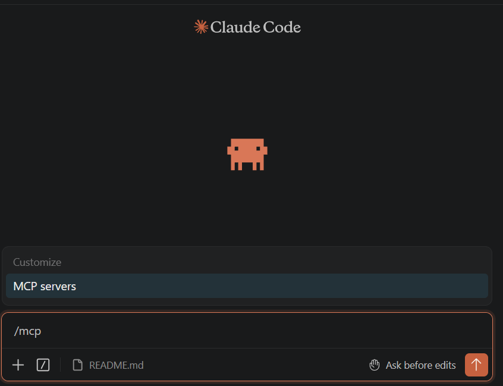
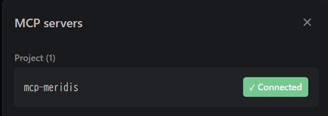

# mcp-meridis

## 概要

本プログラム（mcp-meridis）は Meridian プロジェクトのエコシステム上で動作します。

mcp-meridisは、ロボットの歩行制御・パラメータ管理・状態監視を行うための Python 製 Web アプリです。  
- **GradioによるWeb UI** からボタン操作でロボットを直感的に制御できます
- **MCPサーバー** として AI エージェント（Claude 等）からの自然言語制御にも対応しています。


## 主な機能

- **脚IKに基づく歩行制御（Home / Idle / Walk / Stop）**  
  ボタン一つでロボットの歩行と立位姿勢を制御します。バックグラウンドスレッドが 10ms 周期で位相ベースの脚軌道を計算し、Meridim コマンドを Redis へ送信し続けます。

- **歩行パラメータのライブ編集**  
  足の歩幅・持ち上げ量・横スイング・周期・前傾角などの歩行パラメータを Web UI のテキストで編集し、[メモリを設定] を押すと次フレームから即時反映されます。

- **腕IKに基づく姿勢制御**  
  手先の目標座標 `x,y,z`（腰座標系、単位 m）を入力すると、逆運動学で肩 P / 肩 R / 肘 P の 3 軸角度を自動計算して送信します。

- **MCP サーバー対応**  
  各機能の呼び出しを MCP ツールとして公開しており、Claude Desktop / Claude Code から自然言語のプロンプトで同じ操作が行えます。

- **状態モニタリング**  
  [Status] ボタンで、歩行フェーズ（初期化 / 両足接地 / 重心移動 / 遊脚）・経過時間・IMU 姿勢角・転倒判定などをテキストで一覧表示します。

- **データソースの切替**  
  受信する Redis キー（シミュレーション / 実機 / 管理プロセスなど）を Web UI から選択するだけで、歩行を止めずに即時切り替えられます。

- **歩行データの記録と分析**  
  歩行中に送受信した Meridim 配列（最大 10,000 フレーム）をバッファに蓄積し、CSV に書き出せます。別の分析ツールで、関節角度のリアルタイム可視化・ZMP 推定・比較グラフを生成できます。

- **VLA 腕制御連携**
　本バージョンでは言及しません


### Meridian プロジェクトのエコシステム

> | コンポーネント | 開発者 | 役割 |
> |---|---|---|
> | [Meridian](https://meridian-oss.github.io/#project) | Ninagawa123 | ロボット通信ミドルプロトコル。ESP32 ボードと Meridim90 データ配列で 100 Hz の双方向通信を実現 |
> | [meridis](https://github.com/holypong/meridis) | holypong | Redis を介してシミュレータ・実機ロボット・Web アプリを接続するデータブリッジ |
> | [merimujoco](https://github.com/holypong/merimujoco) | holypong | MuJoCo 物理シミュレーション。meridis 経由で Sim2Real / Real2Sim を提供 |
> | [mcp-meridis](https://github.com/holypong/mcp-meridis) | holypong | Web UI でロボットを操作する Python アプリ。MCPサーバーとして AI エージェントとの連携にも対応 |

---

## 利用方法

### 前提条件

1. [Meridian](https://meridian-oss.github.io/#project) の概要を確認していること。
1. [meridis](https://github.com/holypong/meridis) のセットアップが完了していること。
1. [merimujoco](https://github.com/holypong/merimujoco) のセットアップが完了していること。  
  （Quick Start 1-2 まで確認済みであること）

merimujoco.pyを以下のオプションで起動しておきます。
```python
python merimujoco.py --redis redis-ai.json
```


### 必要なパッケージのインストール

[前提条件](#前提条件)を満たした上で、次のパッケージをインストールしてください。

```bash
pip install "gradio[mcp]>=5.29.0" redis numpy
```

### 起動

```bash
python mcp-meridis.py
```

起動時に、以下のログが表示されます。
```
WalkParams loaded from walkparam.json
LinkParams loaded from linkparam.json
[Config] Loaded Redis configuration from 'redis.json'
[Config] Redis: 127.0.0.1:6379
[Config] Redis Keys: Read='meridis_sim_pub', Write='meridis_ai_pub'
Redis list 'meridis_ai_pub' already exists.
[Info] Starting Gradio web interface...
* Running on local URL:  http://127.0.0.1:7860

🔨 MCP server (using SSE) running at: http://127.0.0.1:7860/gradio_api/mcp/sse
```

起動後、ブラウザで`http://localhost:7860`または`http://127.0.0.1:7860/`を開くと Web UI が表示されます。




先ほどの起動時のログ内の、SSEアクセスポイント`http://127.0.0.1:7860/gradio_api/mcp/sse`は、MCPサーバーとして利用するときに使用します。


### 終了

ターミナル上で CTRL+C で終了してください。

---

## Quick Start

---

### Quick Start 1 : 状態をリセットする

[Sysreset] ボタンを押すと、merimujoco 上のヒューマノイドの状態をリセットします。  
例えば、ヒューマノイドが床に転倒している場合や、起動時の場所から離れてしまった場合に、起動時の状態に戻します。

---

### Quick Start 2 : ホームポジションと待機ポジションを行き来する

merimujoco上のヒューマノイドが、
[Home] ボタンを押すと膝を伸ばして直立姿勢（左図）になります。  
[Idle] ボタンを押すと膝を曲げて、歩行開始の待機姿勢（右図）にしてください。


---

### Quick Start 3 : 歩行の開始と停止

[Walk] ボタンを押すと merimujoco のヒューマノイドが歩行を開始し、Duration に設定した時間が経過すると自動で停止します。  
すばやく停止したい場合は [Stop] ボタンを押してください。  
最初からやり直したい場合は [Sysreset] ボタンを押してください。

---

### Quick Start 4 : 歩行の状態を確認する

歩行中・停止中に[Status]ボタンを繰り返し押すと、状態遷移や姿勢に関する内部情報を取得できます。


---

### Quick Start 5 : AIチャットからMCPサーバー経由でロボットを制御する

mcp-meridis は MCPサーバーとして動作します。

ここでは`Claude desktop`のMCPサーバーの設定を簡単に説明します。
詳しくは公式サイト`https://claude.com`をご覧ください。


### 1) Claude Desktop をインストール

Claude Desktop をインストールして起動します。
https://claude.com/download

### 2) Node.js をインストール

`mcp-remote` を使うために Node.js が必要です。未インストールの場合は [nodejs.org](https://nodejs.org/) からインストールしてください。


### 3) mcp-meridis を起動

別ターミナルで以下を実行します。

```bash
python mcp-meridis.py
```

起動ログに次が出ることを確認します。

```text
🔨 MCP server (using SSE) running at: http://127.0.0.1:7860/gradio_api/mcp/sse
```

### 4) Claude Desktop に MCP 設定を追加

1. Claude Desktop を起動する
2. メニューバーの **「ファイル」→「設定」**（macOS は **「Claude」→「Settings...」**）を開く



3. 左メニューの **「開発者」** を選択する



4. **「設定を編集」** をクリックし、`claude_desktop_config.json` を開く
5. 下記を追加して保存する
```json
{
  "mcpServers": {
    "mcp-meridis": {
      "command": "npx",
      "args": [
        "mcp-remote",
        "http://127.0.0.1:7860/gradio_api/mcp/sse"
      ]
    }
  }
}
```
6. メニューバーの **「ファイル」→「終了」** で閉じる。
7. Claude Desktop を**再起動**する。
8. メニューバーの **「ファイル」→「設定」**（macOS は **「Claude」→「Settings...」**）を開く


9. 左メニューの **「開発者」** を選択する
このとき、`mcp-meridis`が`running`になっていれば成功




### 5) AIチャットでロボットを動かす

以下のプロンプトを打ち込んでください。
merimujo上のヒューマノイドが反応したら成功です。

### 基本プロンプト例

| プロンプト例 | 期待効果 |
|---|---|
| ロボットを歩かせてください | デフォルト時間で歩行開始 |
| 5秒間歩かせてください | 5秒間歩行後に自動停止 |
| ロボットを停止してください | その場足踏みを経由して安全に停止 |
| IDLEポジションをとってください | 歩行直前の立位姿勢へ移行 |
| HOMEポジションをとってください | 全関節をゼロ位置（ホーム姿勢）へ移行 |
| ロボットの状態を確認してください | 歩行状態・時間・IMU・転倒判定などを表示 |
| システムリセットを送信してください | リセット信号を送信してシステムを初期化 |

### うまく接続できないとき

- `python mcp-meridis.py` が起動したままか確認する
- SSE エンドポイントが `http://127.0.0.1:7860/gradio_api/mcp/sse` になっているか確認する
- `claude_desktop_config.json` の JSON 構文（カンマや波括弧）を確認する
- Node.js インストール後に Claude Desktop を再起動する


---

### Quick Start 6 : Claude CodeからMCPサーバー経由でロボットを制御する（オプション）

Claude Code でもMCPサーバーを使用できます

(Claude desktopからのロボット制御で目的を達成できているならこの章は不要です)

### 1) Claude Code をインストール

Claude Code をインストールして起動します。
https://code.claude.com/docs/ja/quickstart

### 2) mcp-meridis を起動

別ターミナルで以下を実行します。

```bash
python mcp-meridis.py
```

起動ログに次が出ることを確認します。

```text
🔨 MCP server (using SSE) running at: http://127.0.0.1:7860/gradio_api/mcp/sse
```

### 3) Claude Code に MCP 設定を追加



Claude Code を起動しているターミナルで以下を実行してください

```bash
claude mcp add --transport sse mcp-meridis http://127.0.0.1:7860/gradio_api/mcp/sse
```

追加後、`/mcp` コマンドで接続状態を確認できます。`connected`であれば成功です。



**設定手順がわからない場合、Claude Code に以下のように依頼するとやってくれます。**

> ```
> mcp-meridis の MCP サーバーを http://127.0.0.1:7860/gradio_api/mcp/sse で SSE 接続として登録してください
> ```


### 4) AIチャットでロボットを動かす

以下のプロンプトを打ち込んでください。 merimujo上のヒューマノイドが反応したら成功です。

---

## 詳細ドキュメント

より詳しい設定・操作方法は [README_advance.md](README_advance.md) を参照してください。
