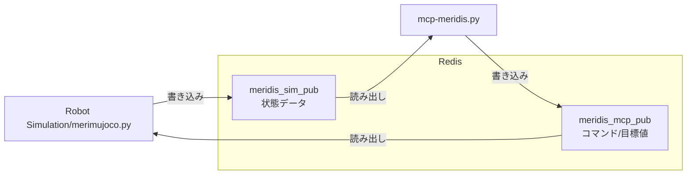
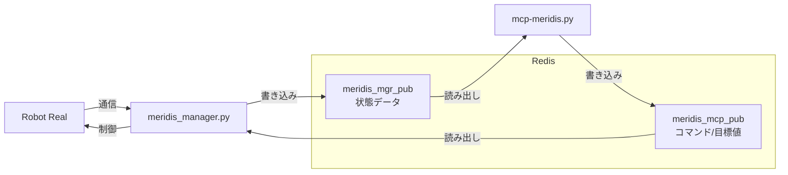

# mcp-meridis

## 概要

mcp-meridisは、ロボットの歩行制御・パラメータ管理・状態監視を行うためのPython製MCP（Model Context Protocol）サーバーです。  
GradioによるWeb UIと、Redisを用いたロボット状態の送受信に対応しています。


本プログラム（mcp-meridis）は Meridian プロジェクトのエコシステム上で動作します。

> **Meridian プロジェクトのエコシステム**
>
> | コンポーネント | 開発者 | 役割 |
> |---|---|---|
> | [Meridian](https://meridian-oss.github.io/#project) | Ninagawa123 | ロボット通信ミドルプロトコル。ESP32 ボードと Meridim90 データ配列で 100 Hz の双方向通信を実現 |
> | [meridis](https://github.com/holypong/meridis) | holypong | Redis ベースのデータブリッジする仕組みで、シミュレータ/実機ロボット/MCPサーバ と接続 |
> | [merimujoco](https://github.com/holypong/merimujoco) | holypong | MuJoCo 物理シミュレーション。meridis 経由で Sim2Real / Real2Sim を提供 |
> | [mcp-meridis](https://github.com/holypong/mcp-meridis) | holypong | AI エージェントと連動するMCPサーバー。歩行動作におけるパラメータ調整/開始・停止の制御/歩行データ収集をプロンプトで指示 |


## 主な機能

- **ロボット歩行制御**  
  Web UIやAPIから歩行開始・停止・リセットなどのコマンドを送信可能

- **パラメータ一括管理**  
  歩行パラメータ・リンク長パラメータを一括取得・編集できるUIとAPIを提供

- **状態監視**  
  ロボットの現在状態（歩行/停止/時間/段階など）を20行のテキストで表示

- **メタデータ出力**  
  各パラメータの説明・型情報（メタデータ）をLLMや外部システムに提供可能

- **Redis連携**  
  ロボット状態の送受信をRedis経由で実施

## 利用方法

### 1. 必要なパッケージのインストール

#### Gradio MCP対応版をインストール

```bash
pip install "gradio[mcp]>=5.29.0"
```

#### その他の依存パッケージをインストール

```bash
pip install numpy redis
```

### 2. サーバーの起動

```bash
python mcp-meridis.py
```

- http://localhost:7860 をブラウザで開いてください

```bash
WalkParams loaded from walkparam.json
LinkParams loaded from linkparam.json
[Config] Loaded Redis configuration from 'redis.json'
[Config] Redis: 127.0.0.1:6379
[Config] Redis Keys: Read='meridis_sim_pub', Write='meridis_mcp_pub'
Redis list 'meridis_mcp_pub' already exists.
[Info] Starting Gradio web interface...
[Info] Redis config loaded from: redis.json
None
* Running on local URL:  http://127.0.0.1:7860
* To create a public link, set `share=True` in `launch()`.

🔨 MCP server (using SSE) running at: http://127.0.0.1:7860/gradio_api/mcp/sse
```

起動時の処理内容は以下の通りです。

1. 歩行パラメータ`walkparam.json`とリンクパラメータ`linkparam.json`を読み込みます。
2. Redis設定ファイル`redis.json`（デフォルト）を読み込みます。
3. Redis接続先（host/port）とキー設定を読み込み、Redis接続を初期化します。
4. Redisクライアントと`WalkController`を初期化し、バックグラウンド制御スレッドを開始します。
5. ローカルUIのURL `http://127.0.0.1:7860` を表示します。
6. MCP（SSE）エンドポイントURL `http://127.0.0.1:7860/gradio_api/mcp/sse` を表示します。


### 3. Redis設定ファイル

起動時は `redis.json` を使用します。別ファイルを使う場合は `--redis` で指定します。

先に `merimujoco` のクイックスタートを確認し、接続モードを決めてください。

| 利用モード | 先に確認する Quick Start | 使用する Redis 設定ファイル |
|---|---|---|
| シミュレーション | Step 1（必要に応じて Step 2 まで） | `redis.json` または `redis-sim.json` |
| ロボット実機 | Step 3 以降 | `redis-mgr.json` |


### 例

```bash
# デフォルト設定（redis.json）でMCPサーバー起動
python mcp-meridis.py

# シミュレーション用Redis設定を指定
python mcp-meridis.py --redis redis-sim.json

# カスタムRedis設定ファイルを指定
python mcp-meridis.py --redis redis-mgr.json

# ヘルプ表示
python mcp-meridis.py --help
```

#### シミュレーションとの接続：redis.json / redis-sim.json




- 読み取りキー: `meridis_sim_pub`（シミュレーション側の状態データ）
- 書き込みキー: `meridis_mcp_pub`（サーバーから送るコマンド/目標値）

```json
{
  "redis": {
    "host": "127.0.0.1",
    "port": 6379
  },
  "redis_keys": {
    "read": "meridis_sim_pub",
    "write": "meridis_mcp_pub"
  }
}
```

#### ロボット実機との接続：redis-mgr.json



- 読み取りキー: `meridis_mgr_pub`（実機/管理側の最新状態データ）
- 書き込みキー: `meridis_mcp_pub`（サーバーから送るコマンド/目標値）

```json
{
  "redis": {
    "host": "127.0.0.1",
    "port": 6379
  },
  "redis_keys": {
    "read": "meridis_mgr_pub",
    "write": "meridis_mcp_pub"
  }
}
```

### 4. Web UIの使い方


- **Controlタブ**  
  Home/Idle/Walk/Stop/Sysreset/Statusボタンで制御・状態確認が可能  
  - **Home**: 全関節をゼロ位置（ホーム姿勢）に移行  
  - **Idle**: 歩行直前の立位姿勢に移行  
  - **Walk**: 歩行開始（Duration欄で歩行時間を秒単位で指定可能）  
  - **Stop**: 歩行停止（その場足踏み経由で安全停止、`smooth_stop`設定で動作変更可能）  
  - **Sysreset**: システムリセット信号送信  
  - **Status**: ロボット状態表示（状態/時間/歩行段階/IMU情報/転倒判定）

- **Paramsタブ**  

  [メモリを取得]で現在値を読み出し、編集後に[メモリを設定]で一括反映  
  [初期設定を取得]でJSON初期値を表示（反映には[メモリを設定]が必要）


- **Redisタブ**  
  Redisキーを選択してリアルタイムデータを表示


- **InputBufタブ**  
  ロボットとの受信データバッファを表示・CSV保存

- **OutputBufタブ**  
  ロボットとの送信データバッファを表示・CSV保存

- **GetKeyIndexタブ**  
  Meridim90配列のキーインデックス一覧を表示

- **SysInfoタブ**  
  システム全体の情報を一括取得（AIエージェント向け）

---

## ファイル構成

- `mcp-meridis.py` ... メインサーバー・UI・制御ロジック
- `redis_receiver.py` ... Redisからのデータ受信
- `redis_transfer.py` ... Redisへのデータ送信
- `mrd_walk_ctrl.py` ... 歩行制御ロジック（WalkController、歩行パラメータ管理）
- `mrd_info.py` ... Meridim90配列キー定義とシステム情報
- `SPEC_MCP.md` ... 歩行制御の理論的背景と要求仕様書
- `CLAUDE.md` ... Claude Code向けのファイル出力ルール
- `README.md` ... このファイル

---

## MCPサーバーの利用方法

### Claude Desktop / Claude Code との接続

#### 前提

`mcp-meridis.py` を先に起動し、以下の SSE エンドポイントが有効な状態にしてください。

```
http://127.0.0.1:7860/gradio_api/mcp/sse
```

---

#### Claude Desktop での接続

**メニューから設定ファイルを開く手順：**

1. Claude Desktop を起動する
2. メニューバーの **「ファイル」→「設定」**（macOS は **「Claude」→「Settings...」**）を開く
3. 左メニューの **「開発者」** を選択する
4. **「設定を編集」** ボタンをクリックする（`claude_desktop_config.json` がエディタで開く）
5. 下記の JSON を追加して保存する
6. Claude Desktop を**再起動**する

```json
{
  "mcpServers": {
    "mcp-meridis": {
      "command": "npx",
      "args": [
        "mcp-remote",
        "http://127.0.0.1:7860/gradio_api/mcp/sse"
      ]
    }
  }
}
```

> `mcp-remote` を使うには Node.js が必要です。未インストールの場合は [nodejs.org](https://nodejs.org/) からインストールしてください。

> 既に `mcpServers` キーが存在する場合は、`"mcp-meridis": { ... }` のブロックだけを既存の `mcpServers` 内に追記してください。

接続が成功すると、チャット画面のツールアイコンに `mcp-meridis` のツール群が表示されます。


---

#### Claude Code（CLI）での接続


Claude Code を起動しているターミナルで、以下のコマンドで MCP サーバーを追加します。

```bash
claude mcp add --transport sse mcp-meridis http://127.0.0.1:7860/gradio_api/mcp/sse
```

追加後、`/mcp` コマンドで接続状態を確認できます。

```
/mcp
```


登録済みのサーバー一覧を確認する場合:

```bash
claude mcp list
```

**設定手順がわからなければ、Claude Code 自身に以下のように依頼するとやってくれます。**

> ```
> mcp-meridis の MCP サーバーを http://127.0.0.1:7860/gradio_api/mcp/sse で SSE 接続として登録してください
> mcp-meridis が MCP サーバーとして登録されているか確認してください
> ```

---

### MCP サーバー機能

AIエージェント（Claude、Cursor等）から利用可能な主要関数：

- `getmrdkey()`: Meridim90キーインデックス一覧取得
- `get_params_text()`: 現在のパラメータテキスト取得
- `set_params_text(text)`: パラメータ一括設定
- `robot_walk(duration)`: ロボット歩行開始
- `robot_stop()`: ロボット停止（その場足踏み経由で安全停止、`smooth_stop`設定により動作変更可能）
- `robot_home()`: ホーム姿勢（全関節ゼロ）へ移行
- `robot_idle()`: IDLE姿勢（歩行直前立位）へ移行
- `robot_status()`: ロボット状態確認
- `system_reset()`: システムリセット
- `get_buf_input(start, count, decimal)`: 受信データバッファ取得
- `get_buf_output(start, count, decimal)`: 送信データバッファ取得
- `filesave_buf_input()`: 受信データをCSV保存
- `filesave_buf_output()`: 送信データをCSV保存
- `filepathget_buf_input()`: 受信データCSVファイルパス取得
- `filepathget_buf_output()`: 送信データCSVファイルパス取得
- `get_redis_data(key)`: 指定RedisキーのデータをJSON形式で取得
- `get_system_info()`: システム情報一括取得

---

### プロンプト例

Claude Desktop または Claude Code で mcp-meridis に接続した状態で、以下のようなプロンプトをそのまま入力できます。

#### 基本操作

| プロンプト例 | 期待効果 |
|---|---|
| ロボットを歩かせてください | デフォルト時間で歩行開始 |
| 5秒間歩かせてください | 5秒間歩行後に自動停止 |
| ロボットを停止してください | その場足踏みを経由して安全に停止 |
| IDLEポジションをとってください | 歩行直前の立位姿勢へ移行 |
| HOMEポジションをとってください | 全関節をゼロ位置（ホーム姿勢）へ移行 |
| ロボットの状態を確認してください | 歩行状態・時間・IMU・転倒判定などを表示 |
| システムリセットを送信してください | リセット信号を送信してシステムを初期化 |

#### パラメータ操作

| プロンプト例 | 期待効果 |
|---|---|
| 現在の歩行パラメータを確認してください | 全パラメータの名前・現在値・説明を一覧表示 |
| 歩行速度を上げてください | 速度関連パラメータを調整して再設定 |
| 歩幅を小さくして、ゆっくり歩かせてください | `stride_length` 等を変更してから歩行開始 |

#### データ収集

| プロンプト例 | 期待効果 |
|---|---|
| 受信バッファを取得してください | ロボットからの最新受信データを表示 |
| 歩行データをCSVに保存してください | 受信・送信バッファをそれぞれ CSV ファイルに保存 |
| システム情報を一括取得してください | パラメータ・Redis設定・状態など全情報をまとめて表示 |

#### 複合操作

| プロンプト例 | 期待効果 |
|---|---|
| IDLEポジションをとってから、3秒間歩かせて、停止してHOMEに戻してください | IDLE → 歩行(3秒) → 停止 → HOME を順番に実行 |
| 歩行パラメータを確認して、stride_lengthを0.03に変更してから10秒間歩かせてください | パラメータ確認 → 変更・設定 → 歩行(10秒) を順番に実行 |
| 歩かせながらステータスを確認して、歩行が終わったらバッファをCSVに保存してください | 歩行開始 → 状態確認 → CSV保存 を順番に実行 |

---
