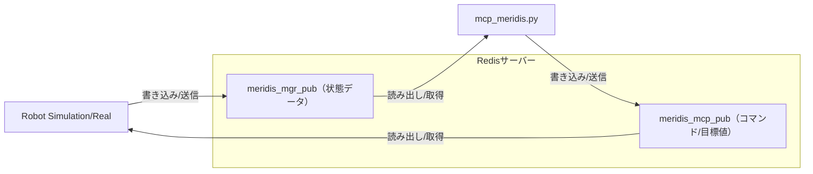

# mcp-meridis

## 概要

mcp-meridisは、ロボットの歩行制御・パラメータ管理・状態監視を行うためのPython製MCP（Model Context Protocol）サーバーです。  
GradioによるWeb UIと、Redisを用いたロボット状態の送受信に対応しています。

## 主な機能

- **ロボット歩行制御**  
  Web UIやAPIから歩行開始・停止・リセットなどのコマンドを送信可能

- **パラメータ一括管理**  
  歩行パラメータ・リンク長パラメータを一括取得・編集できるUIとAPIを提供

- **状態監視**  
  ロボットの現在状態（歩行/停止/時間/段階など）を20行のテキストで表示

- **メタデータ出力**  
  各パラメータの説明・型情報（メタデータ）をLLMや外部システムに提供可能

- **Redis連携**  
  ロボット状態の送受信をRedis経由で実施

## 利用方法

### 1. 必要なパッケージのインストール

```bash
pip install gradio numpy redis
```

### 2. サーバーの起動

```bash
python mcp-meridis.py
```

- デフォルトで http://localhost:7860 でGradio UIが起動します

### 3. Web UIの使い方

- **Controlタブ**  
  Home/Idle/Walk/Stop/Sysreset/Statusボタンで制御・状態確認が可能  
  - **Home**: 全関節をゼロ位置（ホーム姿勢）に移行  
  - **Idle**: 歩行直前の立位姿勢に移行  
  - **Walk**: 歩行開始（Duration欄で歩行時間を秒単位で指定可能）  
  - **Stop**: 歩行停止（歩行中は両足接地後に安全停止）  
  - **Sysreset**: システムリセット信号送信  
  - **Status**: ロボット状態表示（状態/時間/歩行段階）

- **Paramsタブ**  
  [取得]ボタンで現在のパラメータをテキストで取得  
  編集後、[設定]ボタンで一括反映

- **Redisタブ**  
  Redisキーを選択してリアルタイムデータを表示

- **InputBuf / OutputBufタブ**  
  ロボットとの送受信データバッファを表示・CSV保存

- **GetKeyIndexタブ**  
  Meridim90配列のキーインデックス一覧を表示

- **SysInfoタブ**  
  システム全体の情報を一括取得（AIエージェント向け）

---


## Redisキー `meridis_mgr_pub` と `meridis_mcp_pub` の関係

- `meridis_mgr_pub` … ロボット（マイコンボード等）が送信した最新の状態データを格納するキー（読み取り専用）
- `meridis_mcp_pub` … サーバー（このプログラム）が生成し、ロボットに送信するコマンドや目標値データを格納するキー（書き込み専用）

この2つのキーを通じて、ロボットとサーバー間で状態・コマンドのやり取りを行います。

### 関係図（Mermaid）



## ファイル構成

- `mcp-meridis.py` ... メインサーバー・UI・制御ロジック
- `redis_receiver.py` ... Redisからのデータ受信
- `redis_transfer.py` ... Redisへのデータ送信
- `meri_walk_ctrl.py` ... 歩行制御ロジック（WalkController、歩行パラメータ管理）
- `meridim_info.py` ... Meridim90配列キー定義とシステム情報
- `README.md` ... このファイル

---

## mcp-meridis.py

- `mcp-meridis.py` は Gradio ベースの Web インターフェースを持つロボット制御・監視・パラメータ管理システムです。
- MCP（Model Context Protocol）サーバーとしても動作し、AIエージェントからの制御にも対応します。
- Redis を介してロボットとの状態データ・コマンドデータの送受信を行います。

### 使い方

```bash
python mcp-meridis.py [--redis REDIS_CONFIG_FILE]
```

### 引数

- `--redis`（デフォルト: `redis.json`）: Redis設定JSONファイルのパス

### 設定ファイル（redis-sim.json）

Redis接続設定を JSON ファイルで管理します。ファイルが存在しない場合は安全なデフォルト値（127.0.0.1:6379）を使用します。

```json
{
  "redis": {
    "host": "172.22.95.231",
    "port": 6379
  },
  "redis_keys": {
    "read": "meridis_sim_pub",
    "write": "meridis_mcp_pub"
  }
}
```

### 設定ファイル（redis-mgr.json）

Redis接続設定を JSON ファイルで管理します。ファイルが存在しない場合は安全なデフォルト値（127.0.0.1:6379）を使用します。

```json
{
  "redis": {
    "host": "172.22.95.231",
    "port": 6379
  },
  "redis_keys": {
    "read": "meridis_mgr_pub",
    "write": "meridis_mcp_pub"
  }
}
```

### 動作

- **起動時処理**: コマンドライン引数を解析し、Redis設定ファイルを読み込み、Redis クライアントを初期化します。
- **バックグラウンド処理**: 歩行制御は専用スレッドで 10ms 間隔の高精度制御を実行します。
- **Web インターフェース**: Gradio により http://localhost:7860 （MCP モード時は自動設定）で Web UI を提供します。

### Web UI の構成

#### Controlタブ
- **Home**: 全関節をゼロ位置（ホーム姿勢）に段階的に移行（100ステップ、1秒）
- **Idle**: 歩行直前の立位姿勢（IK計算済み）に段階的に移行（100ステップ、1秒）
- **Walk**: 歩行時間（秒）を指定して歩行を開始（Durationフィールドで指定可能）
- **Stop**: 歩行を停止（歩行中は両足接地位相を待って安全停止）
- **Sysreset**: システムリセット信号を送信（data[0]=5556 を1回送信）
- **Status**: ロボットの状態を表示（状態/経過時間/歩行段階）

#### Paramsタブ  
- 歩行パラメータ（WalkParams）とリンクパラメータ（LinkParams）の一括取得・編集・設定
- [取得]ボタンで現在値をテキスト形式で表示
- テキスト編集後、[設定]ボタンで一括反映

#### Redisタブ
- Redis上の複数キー（meridis_sim_pub、meridis_mcp_pub、meridis_mgr_pub等）から選択してリアルタイムデータを表示

#### InputBufタブ
- ロボットからの応答データバッファ（buf_input）を表示
- 開始位置、取得数、小数点桁数を指定して表示可能
- CSV保存機能付き（buf_input.csv）

#### OutputBufタブ
- ロボットへの指令データバッファ（buf_output）を表示
- 開始位置、取得数、小数点桁数を指定して表示可能
- CSV保存機能付き（buf_output.csv）

#### GetKeyIndexタブ
- Meridim90配列のキーインデックス一覧を表示
- 各キーの説明とインデックス番号を確認可能

#### SysInfoタブ
- システム全体の情報を一括取得（キーインデックス、パラメータ、利用可能機能）
- AIエージェントがシステムを理解するための情報を提供

### MCP サーバー機能

AIエージェント（Claude、Cursor等）から利用可能な主要関数：

- `getmrdkey()`: Meridim90キーインデックス一覧取得
- `get_params_text()`: 現在のパラメータテキスト取得
- `set_params_text(text)`: パラメータ一括設定
- `robot_walk(duration)`: ロボット歩行開始
- `robot_stop()`: ロボット停止（歩行中は両足接地後に安全停止）
- `robot_home()`: ホーム姿勢（全関節ゼロ）へ移行
- `robot_idle()`: IDLE姿勢（歩行直前立位）へ移行
- `robot_status()`: ロボット状態確認
- `system_reset()`: システムリセット
- `get_buf_input(start, count, decimal)`: 受信データバッファ取得
- `get_buf_output(start, count, decimal)`: 送信データバッファ取得
- `filesave_buf_input()`: 受信データをCSV保存
- `filesave_buf_output()`: 送信データをCSV保存
- `filepathget_buf_input()`: 受信データCSVファイルパス取得
- `filepathget_buf_output()`: 送信データCSVファイルパス取得
- `get_redis_data(key)`: 指定RedisキーのデータをJSON形式で取得
- `get_system_info()`: システム情報一括取得

### データフロー

```
ロボット → Redis[meridis_mgr_pub] → mcp-meridis.py → 制御演算 → Redis[meridis_mcp_pub] → ロボット
```

- **meridis_mgr_pub**: ロボットからの応答データ（IMUセンサー値、モーター実測値など）
- **meridis_mcp_pub**: ロボットへの指令データ（関節角度指令値、サーボコマンドなど）

### 注記

- バックグラウンド歩行制御は 10ms 間隔で実行され、高精度な時刻同期処理を行います。
- データバッファは最大 10,000 要素まで格納され、CSV エクスポート機能により解析用データとして出力できます。
- パラメータ変更は即座に JSON ファイル（walkparam.json、linkparam.json）に保存されます。
- MCP サーバーモードでは、AIエージェントが全ての制御・監視機能にプログラマティックにアクセス可能です。
- Redis接続エラー、データ変換エラーは適切にハンドリングされ、エラーメッセージとして出力されます。

### 例

```bash
# デフォルト設定（redis.json）でMCPサーバー起動
python mcp-meridis.py

# カスタムRedis設定ファイルを指定
python mcp-meridis.py --redis redis-mgr.json

# シミュレーション用Redis設定を指定
python mcp-meridis.py --redis redis-sim.json

# ヘルプ表示
python mcp-meridis.py --help
```

実装の詳細や利用可能なクラス・メソッドについては [mcp-meridis.py](mcp-meridis.py) を参照してください（`WalkController`、`MeridimKeyParams`、各種 Gradio UI 関数など）。

---
