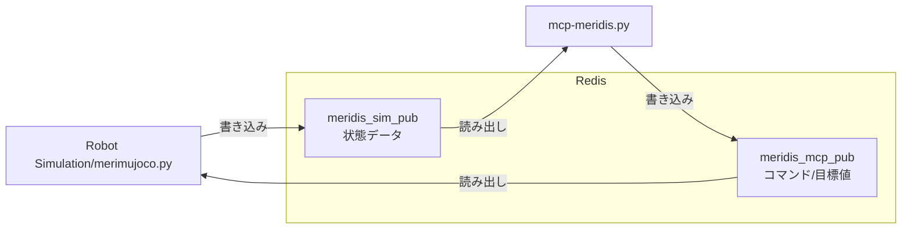
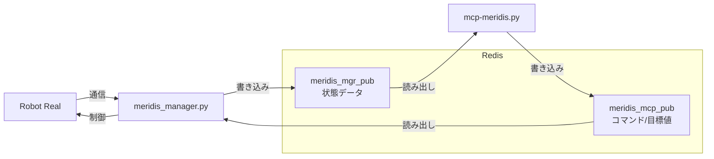

# mcp-meridis

## 概要

mcp-meridisは、ロボットの歩行制御・パラメータ管理・状態監視を行うためのPython製MCP（Model Context Protocol）サーバーです。  
GradioによるWeb UIと、Redisを用いたロボット状態の送受信に対応しています。

## 主な機能

- **ロボット歩行制御**  
  Web UIやAPIから歩行開始・停止・リセットなどのコマンドを送信可能

- **パラメータ一括管理**  
  歩行パラメータ・リンク長パラメータを一括取得・編集できるUIとAPIを提供

- **状態監視**  
  ロボットの現在状態（歩行/停止/時間/段階など）を20行のテキストで表示

- **メタデータ出力**  
  各パラメータの説明・型情報（メタデータ）をLLMや外部システムに提供可能

- **Redis連携**  
  ロボット状態の送受信をRedis経由で実施

## 利用方法

### 1. 必要なパッケージのインストール

#### Gradio MCP対応版をインストール

```bash
pip install "gradio[mcp]>=5.29.0"
```

#### その他の依存パッケージをインストール

```bash
pip install numpy redis
```

### 2. サーバーの起動

```bash
python mcp-meridis.py
```

- http://localhost:7860 をブラウザで開いてください

```bash
WalkParams loaded from walkparam.json
LinkParams loaded from linkparam.json
[Config] Loaded Redis configuration from 'redis.json'
[Config] Redis: 127.0.0.1:6379
[Config] Redis Keys: Read='meridis_sim_pub', Write='meridis_mcp_pub'
Redis list 'meridis_mcp_pub' already exists.
[Info] Starting Gradio web interface...
[Info] Redis config loaded from: redis.json
None
* Running on local URL:  http://127.0.0.1:7860
* To create a public link, set `share=True` in `launch()`.

🔨 MCP server (using SSE) running at: http://127.0.0.1:7860/gradio_api/mcp/sse
```

起動時の処理内容は以下の通りです。

1. 歩行パラメータ`walkparam.json`とリンクパラメータ`linkparam.json`を読み込みます。
2. Redis設定ファイル`redis.json`（デフォルト）を読み込みます。
3. Redis接続先（host/port）とキー設定を読み込み、Redis接続を初期化します。
4. Redisクライアントと`WalkController`を初期化し、バックグラウンド制御スレッドを開始します。
5. ローカルUIのURL `http://127.0.0.1:7860` を表示します。
6. MCP（SSE）エンドポイントURL `http://127.0.0.1:7860/gradio_api/mcp/sse` を表示します。


### 3. Redis設定ファイル

起動時は `redis.json` を使用します。別ファイルを使う場合は `--redis` で指定します。


### 例

```bash
# デフォルト設定（redis.json）でMCPサーバー起動
python mcp-meridis.py

# シミュレーション用Redis設定を指定
python mcp-meridis.py --redis redis-sim.json

# カスタムRedis設定ファイルを指定
python mcp-meridis.py --redis redis-mgr.json

# ヘルプ表示
python mcp-meridis.py --help
```

#### シミュレーションとの接続：redis.json / redis-sim.json




- 読み取りキー: `meridis_sim_pub`（シミュレーション側の状態データ）
- 書き込みキー: `meridis_mcp_pub`（サーバーから送るコマンド/目標値）

```json
{
  "redis": {
    "host": "127.0.0.1",
    "port": 6379
  },
  "redis_keys": {
    "read": "meridis_sim_pub",
    "write": "meridis_mcp_pub"
  }
}
```

#### ロボット実機との接続：redis-mgr.json



- 読み取りキー: `meridis_mgr_pub`（実機/管理側の最新状態データ）
- 書き込みキー: `meridis_mcp_pub`（サーバーから送るコマンド/目標値）

```json
{
  "redis": {
    "host": "127.0.0.1",
    "port": 6379
  },
  "redis_keys": {
    "read": "meridis_mgr_pub",
    "write": "meridis_mcp_pub"
  }
}
```

### 4. Web UIの使い方


- **Controlタブ**  
  Home/Idle/Walk/Stop/Sysreset/Statusボタンで制御・状態確認が可能  
  - **Home**: 全関節をゼロ位置（ホーム姿勢）に移行  
  - **Idle**: 歩行直前の立位姿勢に移行  
  - **Walk**: 歩行開始（Duration欄で歩行時間を秒単位で指定可能）  
  - **Stop**: 歩行停止（その場足踏み経由で安全停止、`smooth_stop`設定で動作変更可能）  
  - **Sysreset**: システムリセット信号送信  
  - **Status**: ロボット状態表示（状態/時間/歩行段階/IMU情報/転倒判定）

- **Paramsタブ**  

  [メモリを取得]で現在値を読み出し、編集後に[メモリを設定]で一括反映  
  [初期設定を取得]でJSON初期値を表示（反映には[メモリを設定]が必要）


- **Redisタブ**  
  Redisキーを選択してリアルタイムデータを表示


- **InputBufタブ**  
  ロボットとの受信データバッファを表示・CSV保存

- **OutputBufタブ**  
  ロボットとの送信データバッファを表示・CSV保存

- **GetKeyIndexタブ**  
  Meridim90配列のキーインデックス一覧を表示

- **SysInfoタブ**  
  システム全体の情報を一括取得（AIエージェント向け）

---

## ファイル構成

- `mcp-meridis.py` ... メインサーバー・UI・制御ロジック
- `redis_receiver.py` ... Redisからのデータ受信
- `redis_transfer.py` ... Redisへのデータ送信
- `mrd_walk_ctrl.py` ... 歩行制御ロジック（WalkController、歩行パラメータ管理）
- `mrd_info.py` ... Meridim90配列キー定義とシステム情報
- `SPEC_MCP.md` ... 歩行制御の理論的背景と要求仕様書
- `CLAUDE.md` ... Claude Code向けのファイル出力ルール
- `README.md` ... このファイル

---

## mcp-meridis.py

- `mcp-meridis.py` は Gradio ベースの Web インターフェースを持つロボット制御・監視・パラメータ管理システムです。
- MCP（Model Context Protocol）サーバーとしても動作し、AIエージェントからの制御にも対応します。
- Redis を介してロボットとの状態データ・コマンドデータの送受信を行います。

起動方法・引数・Redis設定例・Web UIの使い方は、上の「利用方法」を参照してください。
この章では、MCPサーバーとしての公開機能を中心に説明します。

### MCP サーバー機能

AIエージェント（Claude、Cursor等）から利用可能な主要関数：

- `getmrdkey()`: Meridim90キーインデックス一覧取得
- `get_params_text()`: 現在のパラメータテキスト取得
- `set_params_text(text)`: パラメータ一括設定
- `robot_walk(duration)`: ロボット歩行開始
- `robot_stop()`: ロボット停止（その場足踏み経由で安全停止、`smooth_stop`設定により動作変更可能）
- `robot_home()`: ホーム姿勢（全関節ゼロ）へ移行
- `robot_idle()`: IDLE姿勢（歩行直前立位）へ移行
- `robot_status()`: ロボット状態確認
- `system_reset()`: システムリセット
- `get_buf_input(start, count, decimal)`: 受信データバッファ取得
- `get_buf_output(start, count, decimal)`: 送信データバッファ取得
- `filesave_buf_input()`: 受信データをCSV保存
- `filesave_buf_output()`: 送信データをCSV保存
- `filepathget_buf_input()`: 受信データCSVファイルパス取得
- `filepathget_buf_output()`: 送信データCSVファイルパス取得
- `get_redis_data(key)`: 指定RedisキーのデータをJSON形式で取得
- `get_system_info()`: システム情報一括取得


---
