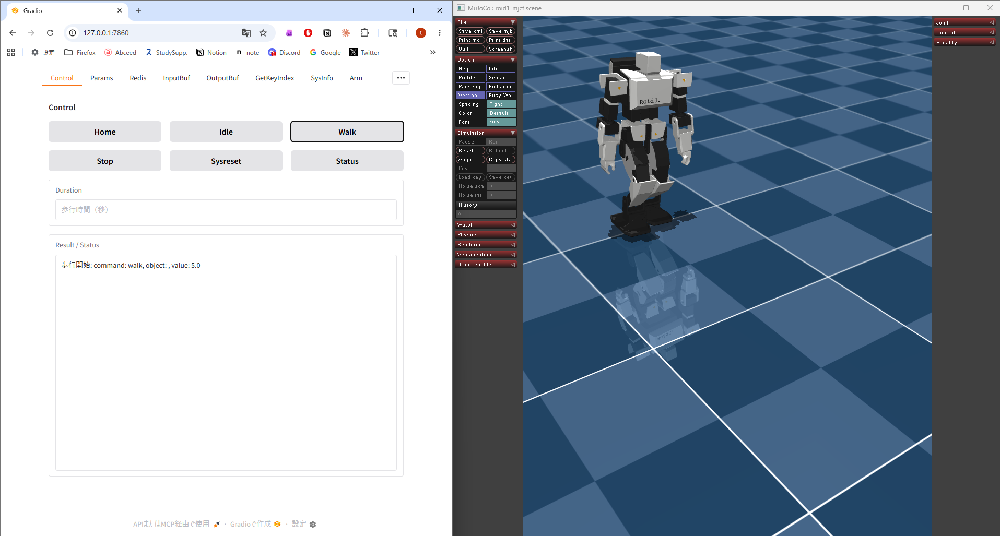
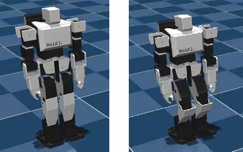
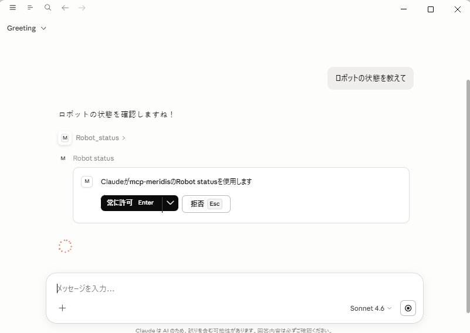
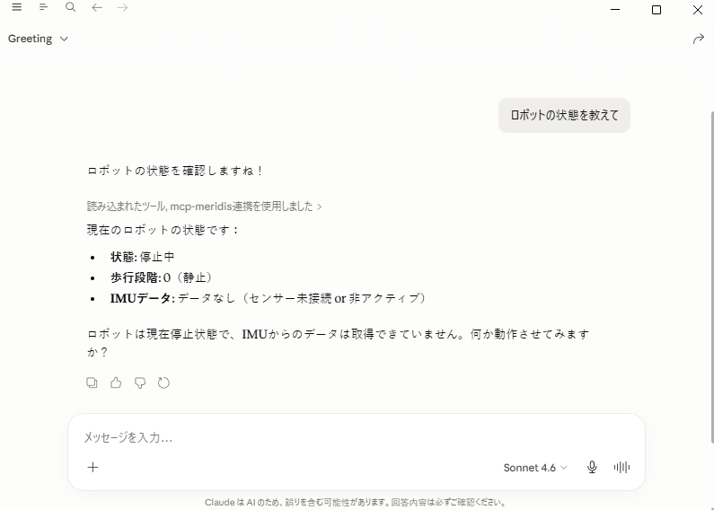
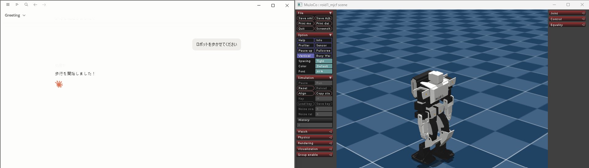

# mcp-meridis


## 概要

本プログラム（mcp-meridis）は Meridian プロジェクトのエコシステム上で動作します。

mcp-meridisは、ロボットの制御（主に歩行）・パラメータ管理・状態監視・ログ分析を行うための Pythonベースの Web アプリです。  
- **Web UI** のボタン操作で、ロボットを直感的に制御できます。
- **MCPサーバー** としても動作するので、AI エージェント（Claude 等）からの自然言語指示にも対応しています。
- 複数のプログラム間でデータを高速に交換（ブリッジ）する目的で **Redisサーバー** を使用しています。



## 主な機能

- **脚の逆運動学(IK)に基づく歩行制御**  
  Web UI上の[Home] [Idle] [Start] [Stop] などのボタンを押すだけで、ヒューマノイドの立位姿勢の変更や歩行の開始・停止を制御します。バックグラウンドスレッド(100Hz)で両足の軌道を逆運動学計算を行い、ヒューマノイド脚の各関節角度の制御コマンドを送信します。

- **腕の逆運動学(IK)に基づく姿勢制御**  
  手先の目標座標 `x,y,z`（腰座標系、単位 m）を入力すると逆運動学を行い、肩 P / 肩 R / 肘 P のヒューマノイド腕の各関節角度の制御コマンドを送信します。

- **MCP サーバー対応**  
  MCPサーバー（Model Context Protocol Server）に対応することで、AIがシミュレータロボット・ロボット実機に接続するのをサポートします。Claude Desktop / Claude Code などのAIチャットから、自然言語指示でヒューマノイドを制御・状態監視・ログ取得できます。

- **状態モニタリング**  
  [Status] ボタンを押下すると、歩行の段階（内部の状態遷移）・経過時間・IMU 姿勢角・転倒判定などを確認できます。

- **歩行パラメータのライブ編集**  
  足の歩幅・持上げ量・腰の横スイング・歩行周期・前傾角などの歩行パラメータを Web UI 上でテキスト編集して[メモリを設定] ボタンを押すことこで、変更したパラメータが即時反映されます。

- **歩行データの記録と分析**  
  歩行中に送受信した Meridim 配列（最大 10,000 フレーム）をバッファに蓄積しCSVファイルとして書き出せます。別の分析ツールで関節角度のリアルタイム可視化・ZMP 推定・比較グラフを生成できます。

- **データソースの切替**  
  Web UI からモニタ・ログしたいデータソースを切り替え可能です。

- **VLA 腕制御連携**  
  VLA(Vison-Language-Action)の SmolVLA 推論プロセス と連携して腕制御が可能です。※SmolVLA を利用したプログラムは 2026.05時点では未公開です。


### Meridian プロジェクトのエコシステム

> | コンポーネント | 開発者 | 役割 |
> |---|---|---|
> | [Meridian](https://meridian-oss.github.io/#project) | Ninagawa123 | ロボット通信ミドルプロトコル。ESP32 ボードと Meridim90 データ配列で 100 Hz の双方向通信を実現 |
> | [meridis](https://github.com/holypong/meridis) | holypong | Redis を介してシミュレータ・実機ロボット・Web アプリを接続するデータブリッジ |
> | [merimujoco](https://github.com/holypong/merimujoco) | holypong | MuJoCo 物理シミュレーション。meridis 経由で Sim2Real / Real2Sim を提供 |
> | [mcp-meridis](https://github.com/holypong/mcp-meridis) | holypong | Web UI でロボットを操作する Python アプリ。MCPサーバーとして AI エージェントとの連携にも対応 |


## 目次

- [概要](#概要)
- [主な機能](#主な機能)
  - [Meridian プロジェクトのエコシステム](#meridian-プロジェクトのエコシステム)
- [利用方法](#利用方法)
  - [前提条件](#前提条件)
  - [必要なパッケージのインストール](#必要なパッケージのインストール)
  - [起動](#起動)
  - [終了](#終了)
- [Quick Start](#quick-start)
  - [Quick Start 1 : 状態をリセットする](#quick-start-1--状態をリセットする)
  - [Quick Start 2 : 立位姿勢を調整する](#quick-start-2--立位姿勢を調整する)
  - [Quick Start 3 : 歩行を開始・停止する](#quick-start-3--歩行を開始停止する)
  - [Quick Start 4 : 歩行の状態を確認する](#quick-start-4--歩行の状態を確認する)
  - [Quick Start 5 : AIチャットからMCPサーバー経由でロボットを制御する（Claude Desktop編）](#quick-start-5--aiチャットからmcpサーバー経由でロボットを制御するclaude-desktop編)
  - [Quick Start 6 : AIチャットからMCPサーバー経由でロボットを制御する（Claude Code編）](#quick-start-6--aiチャットからmcpサーバー経由でロボットを制御する-claude-code編)
- [詳細ドキュメント](#詳細ドキュメント)

---

## 利用方法

### 前提条件

1. [Meridian](https://meridian-oss.github.io/#project) の概要を確認していること。
1. [meridis](https://github.com/holypong/meridis) のセットアップが完了していること。
1. [merimujoco](https://github.com/holypong/merimujoco) のセットアップが完了していること。  
  （Quick Start 1-2 まで確認済みであること）

merimujoco.pyを以下のオプションで起動しておきます。
```python
python merimujoco.py --redis redis-ai.json
```


### 必要なパッケージのインストール

[前提条件](#前提条件)を満たした上で、次のパッケージをインストールしてください。

```bash
pip install "gradio[mcp]>=5.29.0" redis numpy
```

### 起動

```bash
python mcp-meridis.py
```

起動時に、以下のログが表示されます。
```
WalkParams loaded from walkparam.json
LinkParams loaded from linkparam.json
[Config] Loaded Redis configuration from 'redis.json'
[Config] Redis: 127.0.0.1:6379
[Config] Redis Keys: Read='meridis_sim_pub', Write='meridis_ai_pub'
Redis list 'meridis_ai_pub' already exists.
[Info] Starting Gradio web interface...
* Running on local URL:  http://127.0.0.1:7860

🔨 MCP server (using SSE) running at: http://127.0.0.1:7860/gradio_api/mcp/sse
```

起動後、ブラウザで`http://localhost:7860`または`http://127.0.0.1:7860/`を開くと Web UI が表示されます。


先ほどの起動時のログ内の、SSEアクセスポイント`http://127.0.0.1:7860/gradio_api/mcp/sse`は、MCPサーバーとして利用するときに使用します。


### 終了

ターミナル上で CTRL+C で終了してください。

---

## Quick Start

- ヒューマノイドを Web UI から操作したい場合
  - Quick Start 1-4 を試してください
- ヒューマノイドを AIチャット から操作したい場合
  - Quick Start 5 または 6 を試してください

---
### Quick Start 1 : 状態をリセットする

[Sysreset] ボタンを押すと、merimujoco のシステム状態をリセットします。  
例えば、ヒューマノイドが床に転倒していたり初期位置姿勢から離れてしまった場合にヒューマノイドを起動直後の状態に戻します。

---

### Quick Start 2 : 立位姿勢を調整する

merimujoco上のヒューマノイドの立位姿勢を、ホームポジションと待機ポジションで切替えましょう。
[Home] ボタンを押下すると、膝を伸ばした直立したホームポジション（左図）になります。  
[Idle] ボタンを押下すると、膝を少し曲げた歩行直前の待機姿勢（右図）にしてください。



---

### Quick Start 3 : 歩行を開始・停止する

[Walk] ボタンを押すと merimujoco のヒューマノイドが歩行を開始し、Duration に設定した時間が経過すると自動で停止します。  
すばやく停止したい場合は [Stop] ボタンを押してください。  
最初からやり直したい場合は [Sysreset] ボタンを押してください。


---

### Quick Start 4 : 歩行の状態を確認する

歩行中・停止中に[Status]ボタンを繰り返し押すと、状態遷移や姿勢に関する内部情報を取得できます。


---

### Quick Start 5 : AIチャットからMCPサーバー経由でロボットを制御する（Claude Desktop編） 

mcp-meridis は MCPサーバーとして動作します。

ここでは`Claude desktop`のMCPサーバーの設定を簡単に説明します。
詳しくは公式サイト`https://claude.com`をご覧ください。


### 1) Claude Desktop をインストール

Claude Desktop をインストールして起動します。
https://claude.com/download

### 2) Node.js をインストール

`mcp-remote` を使うために Node.js が必要です。未インストールの場合は [nodejs.org](https://nodejs.org/) からインストールしてください。


### 3) mcp-meridis を起動

別ターミナルで以下を実行します。

```bash
python mcp-meridis.py
```

起動ログに次が出ることを確認します。

```text
🔨 MCP server (using SSE) running at: http://127.0.0.1:7860/gradio_api/mcp/sse
```

### 4) Claude Desktop に MCP 設定を追加

1. Claude Desktop を起動する
2. メニューバーの **「ファイル」→「設定」**（macOS は **「Claude」→「Settings...」**）を開く


3. 左メニューの **「開発者」** を選択する


4. **「設定を編集」** をクリックし、`claude_desktop_config.json` を開く
5. 下記を追加して保存する
```json
{
  "mcpServers": {
    "mcp-meridis": {
      "command": "npx",
      "args": [
        "mcp-remote",
        "http://127.0.0.1:7860/gradio_api/mcp/sse"
      ]
    }
  }
}
```
6. メニューバーの **「ファイル」→「終了」** で閉じる。
7. Claude Desktop を**再起動**する。
8. メニューバーの **「ファイル」→「設定」**（macOS は **「Claude」→「Settings...」**）を開く


9. 左メニューの **「開発者」** を選択する
このとき、`mcp-meridis`が`running`になっていれば成功


### 5) AIチャットでロボットを動かす

以下のプロンプトを打ち込んでください。



**[常に許可]ボタンが表示される場合があるので押下してください**  
ロボットの状態が表示されます。




「ロボットを歩かせてください」と指示したとき、merimujoco上のヒューマノイドが反応したら成功です。





### 基本プロンプト例

| プロンプト例 | 期待効果 |
|---|---|
| ロボットの状態を教えて | ロボットの状態を表示 |
| ロボットを歩かせてください | 歩行開始（デフォルト5秒） |
| 3秒間歩かせてください | 3秒間歩行後に自動停止 |
| ロボットを停止してください | その場足踏みを経由して安全に停止 |
| Idleポジションをとってください | 歩行直前の立位姿勢へ移行 |
| Homeポジションをとってください | 全関節をゼロ位置（ホーム姿勢）へ移行 |
| ロボットの状態を確認してください | 歩行状態・時間・IMU・転倒判定などを表示 |
| システムリセットを送信してください | リセット信号を送信してシステムを初期化 |

### トラブルシューティング

MCPサーバーが接続できないとき

- claude desktop がインストールされているか確認してください
- node.js がインストールされているか確認してください
- AIチャット`claude desktop`を起動する前に、`python mcp-meridis.py` が起動されていることを確認してください
- MCPサーバーの起動ログと`claude_desktop_config.json`に記載する SSE エンドポイントが `http://127.0.0.1:7860/gradio_api/mcp/sse` で一致しているかを確認してください
- `claude_desktop_config.json` の JSON 構文（カンマや波括弧）を確認してください

---

### Quick Start 6 : AIチャットからMCPサーバー経由でロボットを制御する （Claude code編）

本章は、AIチャットを`Claude Desktop`から`Claude Code`に変更したケースの説明です。

### 1) Claude Code をインストール

Claude Code をインストールして起動します。
https://code.claude.com/docs/ja/quickstart

### 2) mcp-meridis を起動

別ターミナルで以下を実行します。

```bash
python mcp-meridis.py
```

起動ログに次が出ることを確認します。

```text
🔨 MCP server (using SSE) running at: http://127.0.0.1:7860/gradio_api/mcp/sse
```

### 3) Claude Code に MCP 設定を追加

Claude Code を起動しているターミナルで以下を実行してください

```bash
claude mcp add --transport sse mcp-meridis http://127.0.0.1:7860/gradio_api/mcp/sse
```


追加後、`/mcp` コマンドで接続状態を確認できます。`connected`であれば成功です。


**設定手順がわからない場合、Claude Code に以下のように依頼するとやってくれます。**

> ```
> mcp-meridis の MCP サーバーを http://127.0.0.1:7860/gradio_api/mcp/sse で SSE 接続として登録してください
> ```


### 4) AIチャットでロボットを動かす

Quick Start 5 と同様にプロンプトをチャットに打ち込んでください。 merimujoco上のヒューマノイドが反応したら成功です。

---

## 詳細ドキュメント

[README_advance.md](README_advance.md) では、次の内容をまとめています。

- 起動オプションと接続設定（シミュレーション/実機）
- Web UI 全タブの操作ガイド
- MCPツール一覧と実用プロンプト例
- ログ収集・可視化・解析ツールの使い方
- ファイル構成と主要パラメータのリファレンス
