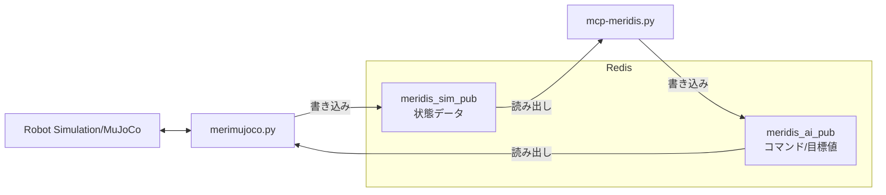

# mcp-meridis

## 概要

本プログラム（mcp-meridis）は Meridian プロジェクトのエコシステム上で動作します。

mcp-meridisは、ロボットの歩行制御・パラメータ管理・状態監視を行うためのPython製MCP（Model Context Protocol）サーバーです。  
GradioによるWeb UIと、Redisを用いたロボット状態の送受信に対応しています。

> **Meridian プロジェクトのエコシステム**
>
> | コンポーネント | 開発者 | 役割 |
> |---|---|---|
> | [Meridian](https://meridian-oss.github.io/#project) | Ninagawa123 | ロボット通信ミドルプロトコル。ESP32 ボードと Meridim90 データ配列で 100 Hz の双方向通信を実現 |
> | [meridis](https://github.com/holypong/meridis) | holypong | Redis を介してシミュレータ・実機ロボット・MCPサーバを接続するデータブリッジ |
> | [merimujoco](https://github.com/holypong/merimujoco) | holypong | MuJoCo 物理シミュレーション。meridis 経由で Sim2Real / Real2Sim を提供 |
> | [mcp-meridis](https://github.com/holypong/mcp-meridis) | holypong | AI エージェントと連動するMCPサーバー。歩行動作におけるパラメータ調整/開始・停止の制御/歩行データ収集をプロンプトで指示 |


## 主な機能

- **ロボット歩行制御**  
  Web UIやAPIからロボットの歩行開始・停止・リセットなどのコマンドを送信可能

- **パラメータ一括管理**  
  歩行パラメータ・リンク長パラメータを一括取得・編集できるUIとAPIを提供

- **状態監視**  
  ロボットの現在状態（歩行/停止/時間/段階など）を20行のテキストで表示

- **メタデータ出力**  
  各パラメータの説明・型情報（メタデータ）をLLMや外部システムに提供可能

- **Redis連携**  
  ロボット状態の送受信をRedis経由で実施

- **Redisキー動的切替**  
  Web UIおよびMCPツール（`set_redis_key_read` / `get_redis_key_read`）から、受信データソース（Redisキー）をリアルタイムに切り替え可能。シミュレーション・実機・管理プロセスなど複数のソースを無停止で切り替えられる

- **腕 IK 制御**  
  手先目標位置 (waist frame, m) を指定するだけで逆運動学を自動計算し、両腕の関節角度を送信。特異点エスケープを自動実行するため、安全に目標へ到達できる

- **VLA 腕制御連携**  
  自然言語タスク文字列を `vla_arm_bridge.py`（SmolVLA 推論プロセス）へ受け渡し、FPV 映像を使った右腕の自律制御を MCP ツール経由で操作できる

## 利用方法

### 前提条件

1. [Meridian](https://meridian-oss.github.io/#project) の概要を確認していること。
1. [meridis](https://github.com/holypong/meridis)のセットアップが完了していること。
1. [merimujoco](https://github.com/holypong/merimujoco)のセットアップが完了していること。
  （Quick Start 1-2 まで確認済みであること）

### 必要なパッケージのインストール

[前提条件](#前提条件)を満たした上で、次の追加インストールを実行してください

#### Gradio MCP対応版をインストール

```bash
pip install "gradio[mcp]>=5.29.0"
```

### MCPサーバーの起動

```bash
python mcp-meridis.py
```

- http://localhost:7860 をブラウザで開いてください

```bash
WalkParams loaded from walkparam.json
LinkParams loaded from linkparam.json
[Config] Loaded Redis configuration from 'redis.json'
[Config] Redis: 127.0.0.1:6379
[Config] Redis Keys: Read='meridis_sim_pub', Write='meridis_ai_pub'
Redis list 'meridis_ai_pub' already exists.
[Info] Starting Gradio web interface...
* Running on local URL:  http://127.0.0.1:7860
* To create a public link, set `share=True` in `launch()`.

🔨 MCP server (using SSE) running at: http://127.0.0.1:7860/gradio_api/mcp/sse
```

起動時の処理内容は以下の通りです。

1. 歩行パラメータ`walkparam.json`とリンクパラメータ`linkparam.json`を読み込みます。
1. Redis設定ファイル`redis.json`（デフォルト）を読み込みます。
1. Redis接続先（host/port）を指定します。
1. Redisキーの設定（Read/Write）を確認します
1. Write先のキーの存在を確認します
1. ローカルUIのURL `http://127.0.0.1:7860` を表示します。
1. MCP（SSE）エンドポイントURL `http://127.0.0.1:7860/gradio_api/mcp/sse` を表示します。


### MCPサーバーの終了

ターミナル上で、CTRL+C で終了してください


### コマンド
```bash
python mcp-meridis.py --redis REDIS_FILE --walkparam WALKPARAM_FILE
```

### オプション
- `--redis`（デフォルト: `redis.json`）: Redis接続先・キーを記述したJSON設定ファイルを指定します。
- `--walkparam`（デフォルト: `walkparam.json`）: 起動時に読み込む歩行パラメータJSONファイルを指定します。


#### シミュレーションとの接続：redis.json / redis-sim.json

- mcp-meridis のインストールディレクトリで以下を実行する
```bash
# シミュレーション用Redis設定を指定
python mcp-meridis.py --redis redis-sim.json
```

- merimujoco のインストールディレクトリで以下を実行する
```bash
# シミュレーションを起動する
python merimujoco.py --redis redis-mcp.json
```

**設定ファイルの内容**
```json
{
  "redis": {
    "host": "127.0.0.1",
    "port": 6379
  },
  "redis_keys": {
    "read": "meridis_sim_pub",
    "write": "meridis_ai_pub"
  }
}
```

- 読み取りキー: `meridis_sim_pub`（シミュレーション側の状態データ）
- 書き込みキー: `meridis_ai_pub`（サーバーから送るコマンド/目標値）




#### ロボット実機との接続：redis-mgr.json

- mcp-meridis のインストールディレクトリで以下を実行する
```bash
# ロボット実機を動かすためのRedis設定ファイルを指定
python mcp-meridis.py --redis redis-mgr.json
```

- meridisのインストールディレクトリで以下を実行する
```bash
# ロボット実機を動かすための設定ファイルを指定（足位置情報があれば変換する)
python meridis_manager.py --mgr mgr_mcp2real.json --foot true
```

**設定ファイルの内容**
```json
{
  "redis": {
    "host": "127.0.0.1",
    "port": 6379
  },
  "redis_keys": {
    "read": "meridis_mgr_pub",
    "write": "meridis_ai_pub"
  }
}
```
- 読み取りキー: `meridis_mgr_pub`（実機/管理側の最新状態データ）
- 書き込みキー: `meridis_ai_pub`（サーバーから送るコマンド/目標値）


---

### Web UIの使い方

- MCPサーバー起動時中に、http://localhost:7860 をブラウザで開いてください


- **Controlタブ**  
  Home/Idle/Walk/Stop/Sysreset/Statusボタンで制御・状態確認が可能  
  - **Home**: 全関節をゼロ位置（ホーム姿勢）に移行  
  - **Idle**: 歩行直前の立位姿勢に移行  
  - **Walk**: 歩行開始（Duration欄で歩行時間を秒単位で指定可能）  
  - **Stop**: 歩行停止（その場足踏み経由で安全停止、`smooth_stop`設定で動作変更可能）  
  - **Sysreset**: システムリセット信号送信  
  - **Status**: ロボット状態表示（状態/時間/歩行段階/IMU情報/転倒判定）


- **Paramsタブ**  

  [メモリを取得]で現在値を読み出し、編集後に[メモリを設定]で一括反映  
  [初期設定を取得]でJSON初期値を表示（反映には[メモリを設定]が必要）


- **Redisタブ**  
  Redisキーをドロップダウンで選択してリアルタイムデータを表示（タブを開くたびに現在キーで更新）  
  - **取得**: 選択キーの全Meridim90データを表示  
  - **PAD取得**: 同キーからPADコントローラ値（ボタン/アナログスティック）のみを抽出して表示


- **InputBufタブ**  
  受信データソースのRedisキーをドロップダウンで選択・切り替え（タブを開くたびに現在キーで更新）。バッファ内容の表示・CSV保存も可能

- **OutputBufタブ**  
  ロボットとの送信データバッファを表示・CSV保存

- **GetKeyIndexタブ**  
  Meridim90配列のキーインデックス一覧を表示

- **SysInfoタブ**  
  システム全体の情報を一括取得（AIエージェント向け）

- **Armタブ**  
  両腕の逆運動学（IK）制御を行います。手先目標位置を `x,y,z` [m]（waist frame）で入力し、IK を計算して関節角度を送信します。

  | ボタン | 対象 | 動作 |
  |---|---|---|
  | **取得** | 両腕 | Redis から現在の関節角度（VAL インデックス）を読み取り、順運動学（FK）で手先位置を計算して表示。テキストボックスにも現在の手先位置を書き込む |
  | **設定**（右腕） | 右腕 | テキストボックスの `X,Y,Z` から IK を計算し、肩P/肩R/肘Y/肘P の 4 軸角度を `meridis_ai_pub` に送信。計算結果・FK 検証誤差を表示 |
  | **準備ポーズ**（右腕） | 右腕 | 肘を 90° 屈曲した安全姿勢（肩P/R=0°、肘Y=0°、肘P=−90°）を送信。特異点（肘がほぼ伸びた状態）から脱出するために使う |
  | **設定**（左腕） | 左腕 | 右腕と同様。左腕の IK を計算して送信 |
  | **準備ポーズ**（左腕） | 左腕 | 左腕を同じ安全姿勢へ移行 |

  > **特異点エスケープ**: 「設定」ボタン押下時に肘P角度が ±8° 未満（ほぼ伸び切った状態）の場合、IK 送信より前に自動で準備ポーズを送信してから目標角度へ移行します。結果欄に `[特異点エスケープ]` と表示されます。

  > **座標系**: waist frame（腰関節原点）。X=前方、Y=左方、Z=上方。右腕の Y 座標は負値になります（例: `0.10,-0.10,0.065`）。

- **VLAタブ**  
  `vla_arm_bridge.py`（SmolVLA 推論プロセス）との連携インターフェースです。タスクの指示・確認と、右腕の角度コマンドの直接上書きを管理します。

  **タスク管理エリア**

  | ボタン | 動作 |
  |---|---|
  | **タスク設定** | テキストボックスに入力した文字列をグローバル変数 `vla_task` にセットし、「現在のタスク」欄に表示。`vla_arm_bridge.py` はこの変数を MCP ツール `get_vla_task()` でポーリングしており、新しいタスクが設定されると SmolVLA への推論指示が切り替わる |
  | **タスク取得** | 現在 `vla_task` に保持されている文字列を「現在のタスク」欄に表示。推論プロセスが実際にどのタスクで動いているかを確認するために使う |

  **腕コマンドエリア**

  | ボタン | 動作 |
  |---|---|
  | **送信** | 入力欄の JSON 配列 `[肩P, 肩R, 肘Y, 肘P]`（deg）を右腕の角度コマンドとして即時送信し、`arm_override_enabled = True` にする。以後、100 Hz の制御ループがこの値を毎フレーム `meridis_ai_pub` の[52〜59]に上書き続ける。`vla_arm_bridge.py` が推論結果を `set_arm_cmd()` で呼び出す仕組みを手動でテストする際に使う |
  | **Override OFF** | 空配列 `[]` を送信することで `arm_override_enabled = False` にする。制御ループによる右腕の上書きが停止し、歩行制御（`mrd_walk_ctrl.py`）や Arm タブの IK 制御が右腕を通常通り管理できる状態に戻る。VLA 推論を止めたいとき・Arm タブへ切り替えたいときに押す |

  > **動作の仕組み**: 「送信」で上書きが有効になると、バックグラウンド制御スレッド（10 ms 周期）が `arm_override` の値を毎フレーム右腕指令として書き込み続けます。`vla_arm_bridge.py` が 10 Hz で推論結果を `set_arm_cmd()` 経由でここに送り込むことで、SmolVLA がロボット右腕を逐次制御します。歩行中も同時に動作するため、歩きながら右腕を VLA 制御することが可能です。

  > **Override OFF を忘れずに**: Override が ON のままだと Arm タブで「設定」を押しても右腕コマンドがすぐ上書きされます。Arm タブへ切り替える前には必ず Override OFF を押してください。

---

## ファイル構成

- `mcp-meridis.py` ... メインサーバー・UI・制御ロジック
- `redis_receiver.py` ... Redisからのデータ受信
- `redis_transfer.py` ... Redisへのデータ送信
- `mrd_walk_ctrl.py` ... 歩行制御ロジック（WalkController、歩行パラメータ管理）
- `mrd_arm_ctrl.py` ... 腕 IK/FK ライブラリ（両腕の逆運動学・可動域クランプ・Meridim インデックス変換）
- `mrd_info.py` ... Meridim90配列キー定義とシステム情報
- `eval_zmp.py` ... センサレス ZMP 評価ライブラリ（ZMPEstimator クラス）
- `redis_logger.py` ... PADボタントリガによるRedisデータロガー（`log/logs-*.csv` に保存）
- `redis_plotter2.py` ... 関節角度・足先位置・ZMP のリアルタイム可視化
- `walkparam.json` ... 歩行パラメータの初期値
- `linkparam.json` ... リンク長・オフセットパラメータ（実機寸法に合わせて調整）
- `README.md` ... このファイル

---

## MCPサーバーの利用方法

### Claude Desktop / Claude Code との接続

`mcp-meridis.py` を先に起動し、以下の SSE エンドポイントが有効な状態にしてください。

```
http://127.0.0.1:7860/gradio_api/mcp/sse
```

---

#### Claude Desktop での接続

**メニューから設定ファイルを開く手順：**

1. Claude Desktop を起動する
2. メニューバーの **「ファイル」→「設定」**（macOS は **「Claude」→「Settings...」**）を開く
3. 左メニューの **「開発者」** を選択する
4. **「設定を編集」** ボタンをクリックする（`claude_desktop_config.json` がエディタで開く）
5. 下記の JSON を追加して保存する
6. Claude Desktop を**再起動**する

```json
{
  "mcpServers": {
    "mcp-meridis": {
      "command": "npx",
      "args": [
        "mcp-remote",
        "http://127.0.0.1:7860/gradio_api/mcp/sse"
      ]
    }
  }
}
```

> `mcp-remote` を使うには Node.js が必要です。未インストールの場合は [nodejs.org](https://nodejs.org/) からインストールしてください。

> 既に `mcpServers` キーが存在する場合は、`"mcp-meridis": { ... }` のブロックだけを既存の `mcpServers` 内に追記してください。

接続が成功すると、チャット画面のツールアイコンに `mcp-meridis` のツール群が表示されます。


---

#### Claude Code（CLI）での接続


Claude Code を起動しているターミナルで、以下のコマンドで MCP サーバーを追加します。

```bash
claude mcp add --transport sse mcp-meridis http://127.0.0.1:7860/gradio_api/mcp/sse
```

追加後、`/mcp` コマンドで接続状態を確認できます。

```
/mcp
```


登録済みのサーバー一覧を確認する場合:

```bash
claude mcp list
```

**設定手順がわからなければ、Claude Code 自身に以下のように依頼するとやってくれます。**

> ```
> mcp-meridis の MCP サーバーを http://127.0.0.1:7860/gradio_api/mcp/sse で SSE 接続として登録してください
> mcp-meridis が MCP サーバーとして登録されているか確認してください
> ```

---

### MCP サーバー機能

AIエージェント（Claude、Cursor等）から利用可能な主要関数：

- `getmrdkey()`: Meridim90キーインデックス一覧取得
- `get_params_text()`: 現在のパラメータテキスト取得
- `set_params_text(text)`: パラメータ一括設定
- `robot_walk(duration)`: ロボット歩行開始
- `robot_stop()`: ロボット停止（その場足踏み経由で安全停止、`smooth_stop`設定により動作変更可能）
- `robot_home()`: ホーム姿勢（全関節ゼロ）へ移行
- `robot_idle()`: IDLE姿勢（歩行直前立位）へ移行
- `robot_status()`: ロボット状態確認
- `system_reset()`: システムリセット
- `get_buf_output(start, count, decimal)`: 送信データバッファ取得
- `filesave_buf_input()`: 受信データをCSV保存
- `filesave_buf_output()`: 送信データをCSV保存
- `filepathget_buf_input()`: 受信データCSVファイルパス取得
- `filepathget_buf_output()`: 送信データCSVファイルパス取得
- `get_redis_data(key)`: 指定RedisキーのデータをJSON形式で取得
- `get_pad_data(key)`: 指定RedisキーからPADコントローラ値（ボタン・アナログスティック）を取得
- `set_redis_key_read(key)`: 受信データソースのRedisキー（`REDIS_KEY_READ`）を変更（即時反映）
- `get_redis_key_read()`: 現在の受信RedisキーとキーID一覧を取得
- `get_buf_input(start, count, decimal, key)`: 受信データバッファ取得（`key`省略時は現在の`REDIS_KEY_READ`を使用）
- `get_initial_params_text()`: JSON ファイルの初期値を取得（メモリへの反映には `set_params_text` が必要）
- `get_system_info()`: システム情報一括取得
- `arm_get_state()`: 両腕の現在関節角度（VAL）と手先位置（FK）を取得
- `arm_set_position(xyz_str)`: 右手先目標位置 `"x,y,z"` [m] を指定して IK 計算・送信（特異点エスケープ付き）
- `left_arm_set_position(xyz_str)`: 左手先目標位置 `"x,y,z"` [m] を指定して IK 計算・送信
- `arm_prep_pose()`: 右腕を準備ポーズ（肘 90° 屈曲）へ移行
- `left_arm_prep_pose()`: 左腕を準備ポーズへ移行
- `set_vla_task(task)`: VLA タスク文字列を設定（`vla_arm_bridge.py` がポーリングして SmolVLA への指示に使用）
- `get_vla_task()`: 現在の VLA タスク文字列を取得
- `set_arm_cmd(values_str)`: 右腕 4 軸角度 `"[肩P, 肩R, 肘Y, 肘P]"` を上書き送信（空配列 `"[]"` で無効化）

---

### プロンプト例

Claude Desktop または Claude Code で mcp-meridis に接続した状態で、以下のようなプロンプトをそのまま入力できます。

#### 基本操作

| プロンプト例 | 期待効果 |
|---|---|
| ロボットを歩かせてください | デフォルト時間で歩行開始 |
| 5秒間歩かせてください | 5秒間歩行後に自動停止 |
| ロボットを停止してください | その場足踏みを経由して安全に停止 |
| IDLEポジションをとってください | 歩行直前の立位姿勢へ移行 |
| HOMEポジションをとってください | 全関節をゼロ位置（ホーム姿勢）へ移行 |
| ロボットの状態を確認してください | 歩行状態・時間・IMU・転倒判定などを表示 |
| システムリセットを送信してください | リセット信号を送信してシステムを初期化 |

#### パラメータ操作

| プロンプト例 | 期待効果 |
|---|---|
| 現在の歩行パラメータを確認してください | 全パラメータの名前・現在値・説明を一覧表示 |
| 歩行速度を上げてください | 速度関連パラメータを調整して再設定 |
| 歩幅を小さくして、ゆっくり歩かせてください | `stride_length` 等を変更してから歩行開始 |

#### Redisキー操作

| プロンプト例 | 期待効果 |
|---|---|
| 現在の受信Redisキーを確認してください | `get_redis_key_read` で現在キーと有効キー一覧を表示 |
| 受信キーをmeridis_mgr_pubに切り替えてください | `set_redis_key_read("meridis_mgr_pub")` を即時反映 |

#### データ収集

| プロンプト例 | 期待効果 |
|---|---|
| 受信バッファを取得してください | ロボットからの最新受信データを表示 |
| 歩行データをCSVに保存してください | 受信・送信バッファをそれぞれ CSV ファイルに保存 |
| システム情報を一括取得してください | パラメータ・Redis設定・状態など全情報をまとめて表示 |

#### 腕 IK 制御

| プロンプト例 | 期待効果 |
|---|---|
| 右腕の現在状態を取得してください | 両腕の関節角度と手先位置（FK）を表示 |
| 右手を前方 10cm・右方 10cm・腰と同じ高さに伸ばしてください | `arm_set_position("0.10,-0.10,0.065")` で IK 計算・送信 |
| 右腕を準備ポーズにしてください | `arm_prep_pose()` で肘 90° 屈曲の安全姿勢へ移行 |

#### VLA 腕制御

| プロンプト例 | 期待効果 |
|---|---|
| 「赤玉に右手で触れて」というタスクを設定してください | `set_vla_task("赤玉に右手で触れて")` を実行し vla_arm_bridge へ伝達 |
| 現在の VLA タスクを確認してください | `get_vla_task()` で現在設定されているタスク文字列を表示 |
| VLA の腕制御を止めてください | `set_arm_cmd("[]")` で arm_override を無効化 |

#### 複合操作

| プロンプト例 | 期待効果 |
|---|---|
| IDLEポジションをとってから、3秒間歩かせて、停止してHOMEに戻してください | IDLE → 歩行(3秒) → 停止 → HOME を順番に実行 |
| 歩行パラメータを確認して、stride_lengthを0.03に変更してから10秒間歩かせてください | パラメータ確認 → 変更・設定 → 歩行(10秒) を順番に実行 |
| 歩かせながらステータスを確認して、歩行が終わったらバッファをCSVに保存してください | 歩行開始 → 状態確認 → CSV保存 を順番に実行 |

---

## データ収集ツール：redis_logger.py

PADコントローラのボタンをトリガとして、Redisからリアルタイムにデータを収集し `log/logs-YYYYMMDDHHMM.csv` に保存するスタンドアロンツールです。

### 使い方

```bash
python redis_logger.py --btn 1                              # ボタン値=1 の間だけ録画
python redis_logger.py --btn 512 --redis redis-mgr.json    # 実機用Redis設定で録画
python redis_logger.py --btn 3 --interval 20               # ポーリング間隔 20 ms
python redis_logger.py --btn 1 --redis-key meridis_sim_pub # Redisキーを直接指定
```

### オプション

| オプション | デフォルト | 説明 |
|---|---|---|
| `--btn` | （必須） | 録画トリガとなる PAD ボタン値（Meridim90[15] の整数値） |
| `--redis` | `redis.json` | Redis接続設定JSONファイル |
| `--redis-key` | JSON の `redis_keys.read` | 読み取るRedisキー名（省略時はJSONから取得） |
| `--interval` | `10.0` ms | ポーリング間隔 |

### 動作仕様

- ボタン値が `--btn` と一致している間だけバッファにデータを蓄積
- ボタン値が変化するか上限（10000行）に達したら `log/` に自動保存
- Ctrl+C で中断した場合も残バッファを保存
- 保存形式は `buf_input.csv` と同じ Meridim90 生データ（ヘッダーなし・90列）

---

## リアルタイム可視化ツール：redis_plotter2.py

Redisからデータを受信し、関節角度・足先位置・ZMP をリアルタイムでグラフ表示するスタンドアロンツールです。

### 使い方

```bash
python redis_plotter2.py                                    # デフォルト設定で起動（joint モード）
python redis_plotter2.py --display foot                    # 足先位置モード
python redis_plotter2.py --display zmp                     # ZMP 評価モード（eval_zmp.py 必須）
python redis_plotter2.py --redis redis-mgr.json            # 実機用Redis設定
python redis_plotter2.py --window 10 --width 12 --height 8 # 表示ウィンドウサイズ調整
```

### オプション

| オプション | デフォルト | 説明 |
|---|---|---|
| `--redis` | `redis.json` | Redis接続設定JSONファイル |
| `--redis-key` | JSON の `redis_keys.read` | 読み取るRedisキー名 |
| `--display` | `joint` | 表示モード: `joint`（関節角度）/ `foot`（足先位置）/ `zmp`（ZMP評価） |
| `--window` | `5.0` s | グラフに表示する時間窓（秒） |
| `--width` | `8` | グラフ幅（インチ） |
| `--height` | `9` | グラフ高さ（インチ） |
| `--log` | `off` | `on` でコンソールへのデータ出力を有効化 |

### 表示モードの説明

| モード | 内容 |
|---|---|
| `joint` | ベースリンク（IMU）・右脚・左脚の関節角度を時系列グラフで表示 |
| `foot` | 左右の足先位置（X/Z）を時系列グラフで表示 |
| `zmp` | PAD状態・ZMP XY軌跡・ZMP時系列・支持多角形マージン・Roll+Pitchを表示（`eval_zmp.py` が必要） |

---

## 歩容パラメータ解説

歩行パラメータは `walkparam.json` に記述され、起動時に読み込まれます。  
MCP ツール `set_params_text` で実行中に変更でき、`get_params_text` で現在値を確認できます。

### タイミング・周期

| パラメータ | デフォルト | 説明 |
|---|---|---|
| `cycle_duration` | 1.2 s | 1歩行周期の時間 |
| `swing_ratio` | 0.4 | 周期中の遊脚期間の割合 (0.0–1.0) |
| `landing_period_ratio` | 0.1 | 両足接地期間の割合 |
| `weight_shift_duration_ratio` | 0.30 | 重心移動期間の割合。小さいと重心が支持脚に乗り切る前に遊脚が上がりやすい |
| `init_wait_time` | 0.0 s | 歩行開始前の待機時間 |
| `phase_offset` | π rad | 左右の位相差（π = 逆位相） |
| `duration` | 5.0 s | 歩行継続時間 |

### 姿勢・軌道

| パラメータ | デフォルト | 説明 |
|---|---|---|
| `foot_lift` | 0.014 m | 遊脚の持ち上げ量 |
| `hip_swing` | 0.016 m | 横方向の重心移動量。小さいと支持脚への重心移動が不足する |
| `lateral_swing_ratio_1st` | 0.8 | 歩行開始1歩目の横スイング倍率 |
| `forward_stride` | 0.02 m | 前後方向の歩幅 |
| `max_stride` | 0.045 m | 前後方向の最大歩幅 |
| `forward_lean_angle` | 2.0 deg | 上体の前傾角度（正値=前傾）。太ももピッチと足首ピッチを同量逆方向に調整し、足裏の接地角を維持する |
| `foot_swing_mode` | 0 | 遊脚軌道モード (0: 正弦波, 1: サイクロイド) |

### 腕振り

| パラメータ | デフォルト | 説明 |
|---|---|---|
| `arm_swing_enable` | false | True: 位相連動腕振り / False: 肩ロール固定 |
| `arm_swing_angle` | 5.0 deg | 腕振り角度振幅（False 時は肩ロール固定角） |
| `arm_swing_phase_offset` | 0.0 rad | 腕振り位相先行量（ヨー方向の角運動量を打ち消すための位相調整） |

### ジャイロフィードバック

| パラメータ | デフォルト | 説明 |
|---|---|---|
| `mix_enable` | false | ジャイロフィードバックの有効化。IMUのロール・ピッチ角速度を足首角度に重畳する |
| `mix_gyro_g_roll` | 0.0001 | ロール軸のジャイロゲイン係数。大きくすると横揺れへの応答が強くなる |
| `mix_gyro_g_pitch` | 0.0002 | ピッチ軸のジャイロゲイン係数。大きくすると前後揺れへの応答が強くなるが、過補正に注意 |

### 停止動作

| パラメータ | デフォルト | 説明 |
|---|---|---|
| `smooth_stop` | false | True: 停止時に自動で1歩追加してその場足踏みへ移行 |
