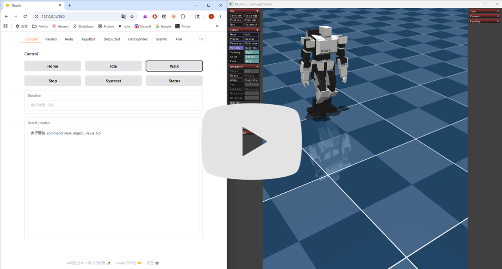

# mcp-meridis

English | [Japanese](README.md)

## Overview

This program, **mcp-meridis**, runs within the Meridian project ecosystem.

mcp-meridis is a Python-based web application for robot control, mainly walking control, parameter management, status monitoring, and log analysis.

- The **Web UI** lets you control the robot intuitively with buttons.
- It also works as an **MCP server**, so AI agents such as Claude can operate it with natural-language instructions.
- It uses a **Redis server** to exchange data quickly between multiple programs.

[](https://www.youtube.com/watch?v=3TW-UL5gDTo&t=3s)

Click the image above to play the YouTube video.

## Main Features

- **Walking control based on leg inverse kinematics (IK)**  
  Press buttons such as [Home], [Idle], [Start], and [Stop] in the Web UI to change the humanoid standing posture and start or stop walking. A background thread running at 100 Hz computes both-foot trajectories with inverse kinematics and sends joint-angle control commands for the humanoid legs.

- **Arm posture control based on arm inverse kinematics (IK)**  
  Enter a hand target position `x,y,z` in the waist coordinate frame, in meters. The system computes inverse kinematics and sends control commands for each humanoid arm joint, such as shoulder P, shoulder R, and elbow P.

- **MCP server support**  
  By supporting MCP Server, Model Context Protocol Server, the system helps AI connect to simulator robots and real robots. From AI chat clients such as Claude Desktop or Claude Code, you can control the humanoid, monitor status, and retrieve logs through natural-language instructions.

- **Status monitoring**  
  Press the [Status] button to check the walking phase, internal state transitions, elapsed time, IMU attitude angles, fall detection, and related status values.

- **Live walking-parameter editing**  
  Walking parameters such as stride length, foot lift, lateral hip swing, gait cycle, and forward lean angle can be edited directly in the Web UI. Press [Set Memory] to apply changed parameters immediately.

- **Walking-data recording and analysis**  
  Meridim arrays sent and received during walking, up to 10,000 frames, can be stored in a buffer and exported as CSV files. Separate analysis tools can visualize joint angles in real time, estimate ZMP, and generate comparison graphs.

- **Data-source switching**  
  The Web UI can switch the data source used for monitoring and logging.

- **VLA arm-control integration**  
  Arm control can be linked with the SmolVLA inference process for VLA, Vision-Language-Action. Programs that use SmolVLA are not public as of 2026.05.

### Meridian Project Ecosystem

> | Component | Developer | Role |
> |---|---|---|
> | [Meridian](https://meridian-oss.github.io/#project) | Ninagawa123 | Robot communication middleware protocol. Uses ESP32 boards and Meridim90 data arrays to provide 100 Hz bidirectional communication |
> | [meridis](https://github.com/holypong/meridis) | holypong | Data bridge that connects simulators, real robots, and web applications through Redis |
> | [merimujoco](https://github.com/holypong/merimujoco) | holypong | MuJoCo physics simulation. Provides Sim2Real / Real2Sim through meridis |
> | [mcp-meridis](https://github.com/holypong/mcp-meridis) | holypong | Python application for robot operation through a Web UI. Also supports AI-agent integration as an MCP server |

## Table of Contents

- [Overview](#overview)
- [Main Features](#main-features)
  - [Meridian Project Ecosystem](#meridian-project-ecosystem)
- [Usage](#usage)
  - [Prerequisites](#prerequisites)
  - [Install Required Packages](#install-required-packages)
  - [Start](#start)
  - [Stop](#stop)
- [Quick Start](#quick-start)
  - [Quick Start 1: Reset the State](#quick-start-1-reset-the-state)
  - [Quick Start 2: Adjust the Standing Posture](#quick-start-2-adjust-the-standing-posture)
  - [Quick Start 3: Start and Stop Walking](#quick-start-3-start-and-stop-walking)
  - [Quick Start 4: Check Walking Status](#quick-start-4-check-walking-status)
  - [Quick Start 5: Control the Robot from AI Chat through the MCP Server, Claude Desktop](#quick-start-5-control-the-robot-from-ai-chat-through-the-mcp-server-claude-desktop)
  - [Quick Start 6: Control the Robot from AI Chat through the MCP Server, Claude Code](#quick-start-6-control-the-robot-from-ai-chat-through-the-mcp-server-claude-code)
- [Detailed Documentation](#detailed-documentation)

---

## Usage

### Prerequisites

1. You have reviewed the overview of [Meridian](https://meridian-oss.github.io/#project).
1. You have completed the setup for [meridis](https://github.com/holypong/meridis).
1. You have completed the setup for [merimujoco](https://github.com/holypong/merimujoco).  
   Quick Start 1 and 2 should already be verified.

Start `merimujoco.py` with the following option:

```python
python merimujoco.py --redis redis-ai.json
```

### Install Required Packages

After satisfying the [Prerequisites](#prerequisites), install the following packages:

```bash
pip install "gradio[mcp]>=5.29.0" redis numpy
```

### Start

```bash
python mcp-meridis.py
```

The following log is displayed at startup:

```text
WalkParams loaded from walkparam.json
LinkParams loaded from linkparam.json
[Config] Loaded Redis configuration from 'redis.json'
[Config] Redis: 127.0.0.1:6379
[Config] Redis Keys: Read='meridis_sim_pub', Write='meridis_ai_pub'
Redis list 'meridis_ai_pub' already exists.
[Info] Starting Gradio web interface...
* Running on local URL:  http://127.0.0.1:7860

MCP server (using SSE) running at: http://127.0.0.1:7860/gradio_api/mcp/sse
```

After startup, open `http://localhost:7860` or `http://127.0.0.1:7860/` in a browser to display the Web UI.


The SSE access point shown in the startup log, `http://127.0.0.1:7860/gradio_api/mcp/sse`, is used when connecting to this application as an MCP server.

### Stop

Press CTRL+C in the terminal.

---

## Quick Start

- If you want to operate the humanoid from the Web UI, try Quick Start 1-4.
- If you want to operate the humanoid from AI chat, try Quick Start 5 or 6.

---

### Quick Start 1: Reset the State

Press the [Sysreset] button to reset the merimujoco system state. For example, if the humanoid has fallen to the floor or moved away from its initial pose, this returns it to the state immediately after startup.

---

### Quick Start 2: Adjust the Standing Posture

Switch the humanoid standing posture in merimujoco between the home position and the idle position.

Press [Home] to move to the upright home position with the knees extended, shown on the left.  
Press [Idle] to move to the standby posture before walking, with the knees slightly bent, shown on the right.


---

### Quick Start 3: Start and Stop Walking

Press [Walk] to start walking in merimujoco. The humanoid stops automatically after the time set in Duration has elapsed.  
Press [Stop] if you want to stop quickly.  
Press [Sysreset] if you want to restart from the beginning.


---

### Quick Start 4: Check Walking Status

Press [Status] repeatedly while walking or stopped to retrieve internal information about state transitions and posture.


---

### Quick Start 5: Control the Robot from AI Chat through the MCP Server, Claude Desktop

mcp-meridis works as an MCP server.

This section briefly explains how to configure the MCP server in `Claude Desktop`. See the official site, `https://claude.com`, for details.

### 1) Install Claude Desktop

Install and start Claude Desktop.

https://claude.com/download

### 2) Install Node.js

Node.js is required to use `mcp-remote`. If it is not installed, install it from [nodejs.org](https://nodejs.org/).

### 3) Start mcp-meridis

Run the following in another terminal:

```bash
python mcp-meridis.py
```

Confirm that the startup log contains:

```text
MCP server (using SSE) running at: http://127.0.0.1:7860/gradio_api/mcp/sse
```

### 4) Add the MCP Configuration to Claude Desktop

1. Start Claude Desktop.
2. Open **File -> Settings** from the menu bar. On macOS, open **Claude -> Settings...**.


3. Select **Developer** from the left menu.


4. Click **Edit Config** and open `claude_desktop_config.json`.
5. Add the following and save it:

```json
{
  "mcpServers": {
    "mcp-meridis": {
      "command": "npx",
      "args": [
        "mcp-remote",
        "http://127.0.0.1:7860/gradio_api/mcp/sse"
      ]
    }
  }
}
```

6. Close Claude Desktop with **File -> Quit**.
7. Restart Claude Desktop.
8. Open **File -> Settings** again. On macOS, open **Claude -> Settings...**.


9. Select **Developer** from the left menu. If `mcp-meridis` is `running`, the setup succeeded.


### 5) Move the Robot from AI Chat

Enter the following prompt:


If an **Always Allow** button appears, press it.  
The robot status is displayed.


When you instruct it to "make the robot walk", the setup is successful if the humanoid in merimujoco reacts.


### Basic Prompt Examples

| Prompt example | Expected effect |
|---|---|
| Tell me the robot status | Display the robot status |
| Please make the robot walk | Start walking, default 5 seconds |
| Please make it walk for 3 seconds | Walk for 3 seconds, then stop automatically |
| Please stop the robot | Stop safely through in-place stepping |
| Move to the Idle position | Move to the standing posture before walking |
| Move to the Home position | Move all joints to the zero-position home posture |
| Please check the robot status | Display walking status, time, IMU, fall detection, and related values |
| Send a system reset | Send the reset signal and initialize the system |

### Troubleshooting

If the MCP server cannot connect:

- Confirm that Claude Desktop is installed.
- Confirm that Node.js is installed.
- Confirm that `python mcp-meridis.py` is running before starting the AI chat client, `Claude Desktop`.
- Confirm that the MCP server startup log and the SSE endpoint written in `claude_desktop_config.json` both use `http://127.0.0.1:7860/gradio_api/mcp/sse`.
- Check the JSON syntax of `claude_desktop_config.json`, including commas and braces.

---

### Quick Start 6: Control the Robot from AI Chat through the MCP Server, Claude Code

This section describes the case where the AI chat client is changed from `Claude Desktop` to `Claude Code`.

### 1) Install Claude Code

Install and start Claude Code.

https://code.claude.com/docs/ja/quickstart

### 2) Start mcp-meridis

Run the following in another terminal:

```bash
python mcp-meridis.py
```

Confirm that the startup log contains:

```text
MCP server (using SSE) running at: http://127.0.0.1:7860/gradio_api/mcp/sse
```

### 3) Add the MCP Configuration to Claude Code

Run the following in the terminal where Claude Code is running:

```bash
claude mcp add --transport sse mcp-meridis http://127.0.0.1:7860/gradio_api/mcp/sse
```


After adding it, you can check the connection status with the `/mcp` command. If it shows `connected`, the setup succeeded.


If you do not know how to configure it, you can ask Claude Code as follows:

> ```text
> Please register the mcp-meridis MCP server as an SSE connection at http://127.0.0.1:7860/gradio_api/mcp/sse
> ```

### 4) Move the Robot from AI Chat

Enter prompts in the chat as in Quick Start 5. The setup is successful if the humanoid in merimujoco reacts.

---

## Detailed Documentation

[Read the technical specification](README_advance_EN.md) summarizes the following topics:

- Startup options and connection settings for simulation and real robots
- Operation guide for every Web UI tab
- MCP tool list and practical prompt examples
- How to use log collection, visualization, and analysis tools
- File structure and reference for major parameters

[Background, Purpose, and Glossary](https://github.com/holypong/meridis/blob/main/README_concept.md)

- Background for using Meridian as the base
- Purpose of making this an MCP server
- Glossary for physical AI and related terms


## License

This project is licensed under the MIT License - see the LICENSE file for details.
