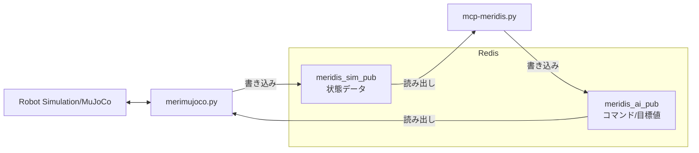
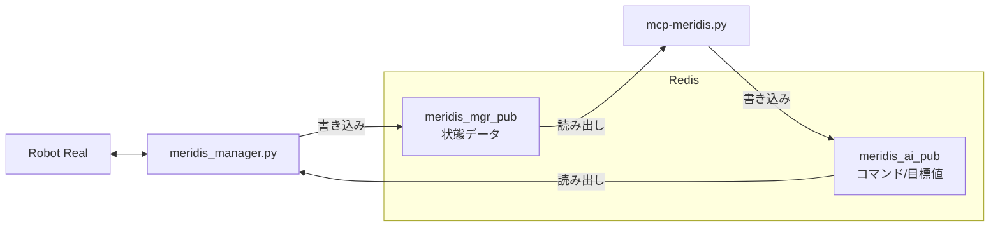

# mcp-meridis 詳細操作ガイド

[English](README_advance_EN.md) | 日本語

Quick Start は [README.md](README.md) を参照してください。

---

## コマンドとオプション

```bash
python mcp-meridis.py --redis REDIS_FILE --walkparam WALKPARAM_FILE --linkparam LINKPARAM_FILE
```

| オプション | デフォルト | 説明 |
|---|---|---|
| `--redis` | `redis.json` | Redis接続先・キーを記述したJSON設定ファイルを指定します |
| `--walkparam` | `walkparam.json` | 起動時に読み込む歩行パラメータJSONファイルを指定します |
| `--linkparam` | `linkparam.json` | 起動時に読み込むリンクパラメータJSONファイルを指定します（未指定時は `linkparam.json` を読みます） |

---

## シミュレーションとの接続：redis-sim.json

- mcp-meridis のインストールディレクトリで以下を実行する
```bash
python mcp-meridis.py --redis redis-sim.json
```

- merimujoco のインストールディレクトリで以下を実行する
```bash
python merimujoco.py --redis redis-ai.json
```

**設定ファイルの内容**
```json
{
  "redis": {
    "host": "127.0.0.1",
    "port": 6379
  },
  "redis_keys": {
    "read": "meridis_sim_pub",
    "write": "meridis_ai_pub"
  }
}
```

- 読み取りキー: `meridis_sim_pub`（シミュレーション側の状態データ）
- 書き込みキー: `meridis_ai_pub`（サーバーから送るコマンド/目標値）



---

## ロボット実機との接続：redis-mgr.json

- mcp-meridis のインストールディレクトリで以下を実行する
```bash
python mcp-meridis.py --redis redis-mgr.json
```

- meridisのインストールディレクトリで以下を実行する
```bash
python meridis_manager.py --mgr mgr_ai2real.json --foot true
```

**設定ファイルの内容**
```json
{
  "redis": {
    "host": "127.0.0.1",
    "port": 6379
  },
  "redis_keys": {
    "read": "meridis_mgr_pub",
    "write": "meridis_ai_pub"
  }
}
```
- 読み取りキー: `meridis_mgr_pub`（実機/管理側の最新状態データ）
- 書き込みキー: `meridis_ai_pub`（サーバーから送るコマンド/目標値）



---

## Web UI操作ガイド

ブラウザで `http://localhost:7860`（または `http://127.0.0.1:7860/`）を開くと Web UI が表示されます。ここでは全タブの用途と代表操作をまとめます。

### Controlタブ

Home/Idle/Walk/Stop/Sysreset/Status ボタンで制御・状態確認が可能です。

- **Home**: 全関節をゼロ位置（ホームポジション）に移行
- **Idle**: 歩行直前の待機姿勢に移行
- **Walk**: 歩行開始（Duration 欄で歩行時間を秒単位で指定可能）
- **Stop**: 歩行停止（その場足踏み経由で安全停止、`smooth_stop` 設定で動作変更可能）
- **Sysreset**: システムリセット信号送信
- **Status**: ロボット状態表示（状態/時間/歩行段階/IMU情報/転倒判定）


### Paramsタブ

[メモリを取得] で現在値を読み出し、編集後に [メモリを設定] で一括反映します。
[初期設定を取得] で JSON 初期値を表示（反映には [メモリを設定] が必要）。


### Redisタブ

Redisキーをドロップダウンで選択してリアルタイムデータを表示（タブを開くたびに現在キーで更新）  
- **取得**: 選択キーの全Meridim90データを表示  
- **PAD取得**: 同キーからPADコントローラ値（ボタン/アナログスティック）のみを抽出して表示


### InputBufタブ

受信データソースのRedisキーをドロップダウンで選択・切り替え（タブを開くたびに現在キーで更新）。バッファ内容の表示・CSV保存も可能。


### OutputBufタブ

ロボットとの送信データバッファを表示・CSV保存。


### GetKeyIndexタブ

Meridim90配列のキーインデックス一覧を表示。


### SysInfoタブ

システム全体の情報を一括取得（AIエージェント向け）。


### Armタブ

両腕の逆運動学（IK）制御を行います。手先目標位置を `x,y,z` [m]（waist frame）で入力し、IK を計算して関節角度を送信します。


| ボタン | 対象 | 動作 |
|---|---|---|
| **取得** | 両腕 | Redis から現在の関節角度（VAL インデックス）を読み取り、順運動学（FK）で手先位置を計算して表示。テキストボックスにも現在の手先位置を書き込む |
| **設定**（右腕） | 右腕 | テキストボックスの `X,Y,Z` から IK を計算し、肩P/肩R/肘Y/肘P の 4 軸角度を `meridis_ai_pub` に送信。計算結果・FK 検証誤差を表示 |
| **準備ポーズ**（右腕） | 右腕 | 肘を 90° 屈曲した安全姿勢（肩P/R=0°、肘Y=0°、肘P=−90°）を送信。特異点（肘がほぼ伸びた状態）から脱出するために使う |
| **設定**（左腕） | 左腕 | 右腕と同様。左腕の IK を計算して送信 |
| **準備ポーズ**（左腕） | 左腕 | 左腕を同じ安全姿勢へ移行 |

> **特異点エスケープ**: 「設定」ボタン押下時に肘P角度が ±8° 未満（ほぼ伸び切った状態）の場合、IK 送信より前に自動で準備ポーズを送信してから目標角度へ移行します。結果欄に `[特異点エスケープ]` と表示されます。

> **座標系**: waist frame（腰関節原点）。X=前方、Y=左方、Z=上方。右腕の Y 座標は負値になります（例: `0.10,-0.10,0.065`）。

### VLAタブ

SmolVLA 推論プロセスとの連携する Web UIです。
`vla_arm_bridge.py`(2026.05 未公開)とタスクの指示・確認と、右腕の角度コマンドの直接上書きを管理します。


**タスク管理エリア**

| ボタン | 動作 |
|---|---|
| **タスク設定** | テキストボックスに入力した文字列をグローバル変数 `vla_task` にセットし、「現在のタスク」欄に表示。`vla_arm_bridge.py` はこの変数を MCP ツール `get_vla_task()` でポーリングしており、新しいタスクが設定されると SmolVLA への推論指示が切り替わる |
| **タスク取得** | 現在 `vla_task` に保持されている文字列を「現在のタスク」欄に表示。推論プロセスが実際にどのタスクで動いているかを確認するために使う |

**腕コマンドエリア**

| ボタン | 動作 |
|---|---|
| **送信** | 入力欄の JSON 配列 `[肩P, 肩R, 肘Y, 肘P]`（deg）を右腕の角度コマンドとして即時送信し、`arm_override_enabled = True` にする。以後、100 Hz の制御ループがこの値を毎フレーム `meridis_ai_pub` の[52〜59]に上書き続ける |
| **Override OFF** | 空配列 `[]` を送信することで `arm_override_enabled = False` にする。制御ループによる右腕の上書きが停止し、歩行制御や Arm タブの IK 制御が右腕を通常通り管理できる状態に戻る |

> **動作の仕組み**: 「送信」で上書きが有効になると、バックグラウンド制御スレッド（10 ms 周期）が `arm_override` の値を毎フレーム右腕指令として書き込み続けます。`vla_arm_bridge.py` が 10 Hz で推論結果を `set_arm_cmd()` 経由でここに送り込むことで、SmolVLA がロボット右腕を逐次制御します。歩行中も同時に動作するため、歩きながら右腕を VLA 制御することが可能です。

> **Override OFF を忘れずに**: Override が ON のままだと Arm タブで「設定」を押しても右腕コマンドがすぐ上書きされます。Arm タブへ切り替える前には必ず Override OFF を押してください。

---

## MCP サーバー機能 全一覧

AIエージェント（Claude、Cursor等）から利用可能な関数（全28件）：

### ロボット制御

| 関数 | 引数 | 説明 |
|---|---|---|
| `robot_home()` | なし | 全関節ゼロのホーム姿勢へ移行 |
| `robot_idle()` | なし | IDLE姿勢（歩行直前立位）へ移行 |
| `robot_walk(duration)` | `duration` — 歩行時間（秒）。省略時は `params.duration` を使用 | ロボット歩行開始 |
| `robot_stop()` | なし | ロボット停止。`smooth_stop=True` でサイクル完了後に停止、`False` でその場足踏み後に即停止 |
| `system_reset()` | なし | システムリセット信号（data[0]=5556）を送信し、両腕IKを解除 |
| `robot_status()` | なし | ロボット状態確認（状態・時間・歩行段階・IMU加速度/ジャイロ/姿勢角・転倒判定） |

### パラメータ

| 関数 | 引数 | 説明 |
|---|---|---|
| `getmrdkey()` | なし | Meridim90 キーインデックス一覧取得 |
| `get_params_text()` | なし | 現在のパラメータテキスト取得（WalkParams + LinkParams） |
| `set_params_text(text)` | `text` — `[WalkParams]` / `[LinkParams]` セクション形式のテキスト | パラメータ一括設定 |
| `get_initial_params_text()` | なし | JSON ファイルの初期値を取得（メモリへの反映には `set_params_text` が必要） |
| `get_system_info()` | なし | システム情報一括取得（AIエージェント向け） |

### Redis

| 関数 | 引数 | 説明 |
|---|---|---|
| `get_redis_data(key)` | `key` — Redisキー名 | 指定RedisキーのMeridim90全データを取得 |
| `get_pad_data(key)` | `key` — Redisキー名 | 指定RedisキーからPADコントローラ値（ボタン・アナログスティック）を取得 |
| `set_redis_key_read(key)` | `key` — 有効値: `meridis_sim_pub` / `meridis_ai_pub` / `meridis_calc_pub` / `meridis_mgr_pub` / `meridis_console_pub` | 受信データソースの `REDIS_KEY_READ` を変更（即時反映） |
| `get_redis_key_read()` | なし | 現在の受信RedisキーとキーID一覧を取得 |

### バッファ

| 関数 | 引数 | 説明 |
|---|---|---|
| `get_buf_input(start, count, decimal, key)` | `start` — 開始位置、`count` — 取得数、`decimal` — 小数点桁数、`key` — Redisキー（省略時は現在の `REDIS_KEY_READ`） | 受信データバッファ取得 |
| `get_buf_output(start, count, decimal)` | `start` — 開始位置、`count` — 取得数、`decimal` — 小数点桁数 | 送信データバッファ取得 |
| `filesave_buf_input()` | なし | 受信データを `buf_input.csv` に保存 |
| `filesave_buf_output()` | なし | 送信データを `buf_output.csv` に保存 |

### 腕 IK 制御

| 関数 | 引数 | 説明 |
|---|---|---|
| `arm_get_state()` | なし | 両腕の現在関節角度（VAL）と手先位置（FK）を取得 |
| `arm_set_position(xyz_str)` | `xyz_str` — `"x,y,z"` [m]（waist frame） | 右手先目標位置から IK 計算・送信（特異点エスケープ付き） |
| `arm_prep_pose()` | なし | 右腕を準備ポーズ（肩P/R=0°、肘Y=0°、肘P=−90°）へ移行 |
| `left_arm_set_position(xyz_str)` | `xyz_str` — `"x,y,z"` [m]（waist frame） | 左手先目標位置から IK 計算・送信 |
| `left_arm_prep_pose()` | なし | 左腕を準備ポーズへ移行 |

### VLA 腕制御

| 関数 | 引数 | 説明 |
|---|---|---|
| `set_vla_task(task)` | `task` — タスク文字列 | VLA タスクを設定（`vla_arm_bridge.py` がポーリングして SmolVLA への指示に使用） |
| `get_vla_task()` | なし | 現在の VLA タスク文字列を取得 |
| `set_arm_cmd(values_str)` | `values_str` — `"[肩P, 肩R, 肘Y, 肘P]"` [deg]、空配列 `"[]"` で無効化 | 右腕4軸角度を上書き送信し `arm_override` を有効化 |
| `arm_override_off()` | なし | `arm_override` を無効化（VLA/Override ON 状態を解除） |

---

## プロンプト例

Claude Desktop または Claude Code で mcp-meridis に接続した状態で、以下のようなプロンプトをそのまま入力できます。

### パラメータ操作

| プロンプト例 | 期待効果 |
|---|---|
| 現在の歩行パラメータを確認してください | 全パラメータの名前・現在値・説明を一覧表示 |
| 歩行速度を上げてください | 速度関連パラメータを調整して再設定 |
| 歩幅を小さくして、ゆっくり歩かせてください | `stride_length` 等を変更してから歩行開始 |

### Redisキー操作

| プロンプト例 | 期待効果 |
|---|---|
| 現在の受信Redisキーを確認してください | `get_redis_key_read` で現在キーと有効キー一覧を表示 |
| 受信キーをmeridis_mgr_pubに切り替えてください | `set_redis_key_read("meridis_mgr_pub")` を即時反映 |

### データ収集

| プロンプト例 | 期待効果 |
|---|---|
| 受信バッファを取得してください | ロボットからの最新受信データを表示 |
| 歩行データをCSVに保存してください | 受信・送信バッファをそれぞれ CSV ファイルに保存 |
| システム情報を一括取得してください | パラメータ・Redis設定・状態など全情報をまとめて表示 |

### 腕 IK 制御

| プロンプト例 | 期待効果 |
|---|---|
| 右腕の現在状態を取得してください | 両腕の関節角度と手先位置（FK）を表示 |
| 右手を前方 10cm・右方 10cm・腰と同じ高さに伸ばしてください | `arm_set_position("0.10,-0.10,0.065")` で IK 計算・送信 |
| 右腕を準備ポーズにしてください | `arm_prep_pose()` で肘 90° 屈曲の安全姿勢へ移行 |

### VLA 腕制御

| プロンプト例 | 期待効果 |
|---|---|
| 「赤玉に右手で触れて」というタスクを設定してください | `set_vla_task("赤玉に右手で触れて")` を実行し vla_arm_bridge へ伝達 |
| 現在の VLA タスクを確認してください | `get_vla_task()` で現在設定されているタスク文字列を表示 |
| VLA の腕制御を止めてください | `set_arm_cmd("[]")` で arm_override を無効化 |

### 複合操作

| プロンプト例 | 期待効果 |
|---|---|
| IDLEポジションをとってから、3秒間歩かせて、停止してHOMEに戻してください | IDLE → 歩行(3秒) → 停止 → HOME を順番に実行 |
| 歩行パラメータを確認して、stride_lengthを0.03に変更してから10秒間歩かせてください | パラメータ確認 → 変更・設定 → 歩行(10秒) を順番に実行 |
| 歩かせながらステータスを確認して、歩行が終わったらバッファをCSVに保存してください | 歩行開始 → 状態確認 → CSV保存 を順番に実行 |

---

## 歩容パラメータ解説

歩行パラメータは `walkparam.json` に記述され、起動時に読み込まれます。
MCP ツール `set_params_text` で実行中に変更でき、`get_params_text` で現在値を確認できます。

### タイミング・周期

| パラメータ | デフォルト | 説明 |
|---|---|---|
| `cycle_duration` | 1.2 s | 1歩行周期の時間 |
| `swing_ratio` | 0.4 | 周期中の遊脚期間の割合 (0.0–1.0) |
| `landing_period_ratio` | 0.1 | 両足接地期間の割合 |
| `weight_shift_duration_ratio` | 0.30 | 重心移動期間の割合。小さいと重心が支持脚に乗り切る前に遊脚が上がりやすい |
| `init_wait_time` | 0.0 s | 歩行開始前の待機時間 |
| `phase_offset` | π rad | 左右の位相差（π = 逆位相） |
| `duration` | 5.0 s | 歩行継続時間 |

### 姿勢・軌道

| パラメータ | デフォルト | 説明 |
|---|---|---|
| `foot_lift` | 0.014 m | 遊脚の持ち上げ量 |
| `hip_swing` | 0.016 m | 横方向の重心移動量。小さいと支持脚への重心移動が不足する |
| `lateral_swing_ratio_1st` | 0.8 | 歩行開始1歩目の横スイング倍率 |
| `forward_stride` | 0.02 m | 前後方向の歩幅 |
| `max_stride` | 0.045 m | 前後方向の最大歩幅 |
| `forward_lean_angle` | 2.0 deg | 上体の前傾角度（正値=前傾）。太ももピッチと足首ピッチを同量逆方向に調整し、足裏の接地角を維持する |
| `foot_swing_mode` | 0 | 遊脚軌道モード (0: 正弦波, 1: サイクロイド) |

### 腕振り

| パラメータ | デフォルト | 説明 |
|---|---|---|
| `arm_swing_enable` | true | True: 位相連動腕振り / False: 肩ロール固定 |
| `arm_swing_angle` | 5.0 deg | 腕振り角度振幅（False 時は肩ロール固定角） |
| `arm_swing_phase_offset` | 0.0 rad | 腕振り位相先行量（ヨー方向の角運動量を打ち消すための位相調整） |

### ジャイロフィードバック

| パラメータ | デフォルト | 説明 |
|---|---|---|
| `mix_enable` | false | ジャイロフィードバックの有効化。IMUのロール・ピッチ角速度を足首角度に重畳する |
| `mix_gyro_g_roll` | 0.0001 | ロール軸のジャイロゲイン係数。大きくすると横揺れへの応答が強くなる |
| `mix_gyro_g_pitch` | 0.0002 | ピッチ軸のジャイロゲイン係数。大きくすると前後揺れへの応答が強くなるが、過補正に注意 |

### 停止動作

| パラメータ | デフォルト | 説明 |
|---|---|---|
| `smooth_stop` | false | True: 停止時に自動で1歩追加してその場足踏みへ移行 |

---

## リンクパラメータ解説

`linkparam.json` は脚IK、腕IK、ZMP推定で使用するロボット寸法をまとめた設定ファイルです。Paramsタブ/MCPの `get_params_text` では脚制御用の `LinkParams` が表示され、腕IKとZMP推定では同じJSONから追加の腕・足裏寸法も読み込みます。

### 脚IK・歩行制御

| パラメータ | 説明 |
|---|---|
| `HIP_OFFSET_Y` | 腰中心から股関節ロール軸までのY方向オフセット |
| `THIGH_LENGTH` | 太ももの長さ |
| `SHANK_LENGTH` | すねの長さ |
| `ANKLE_LENGTH` | 足首リンク長 |
| `FOOT_OFFSET_Z` | 足首ロール軸から足裏までのZ方向オフセット |
| `FOOT_OFFSET_Y` | 足首ロール軸から足裏中心までのY方向オフセット |
| `SHORTEN_LEG_LENGTH` | 立位姿勢で脚を短縮する量 |

### ZMP推定

| パラメータ | 説明 |
|---|---|
| `FOOT_HALF_LEN` | 足裏支持多角形の前後半長 |
| `FOOT_HALF_WIDTH` | 足裏支持多角形の左右半幅 |

### 腕IK

| パラメータ | 説明 |
|---|---|
| `SHOULDER_OFFSET_X` | waist frameから肩関節までのX方向オフセット |
| `SHOULDER_OFFSET_Y` | waist frameから肩関節までのY方向オフセット |
| `SHOULDER_OFFSET_Z` | waist frameから肩関節までのZ方向オフセット |
| `UPPER_ARM_LENGTH` | 上腕長 |
| `LOWER_ARM_LENGTH` | 前腕長 |

---

## ファイル構成

- マニュアル
  - `README.md` ... Quick Start ガイド
  - `README_advance.md` ... このファイル（詳細操作ガイド）

- メイン
  - `mcp-meridis.py` ... メインサーバー・UI・制御ロジック
  - `walkparam.json` ... 歩行パラメータの初期値
  - `walkparam-fast.json` ... 高速歩行用の歩行パラメータプリセット
  - `linkparam.json` ... 脚・足裏・腕・頭部のリンク長/オフセットパラメータ（実機寸法に合わせて調整）

- ライブラリ
  - `mrd_walk_ctrl.py` ... 歩行制御ロジック（WalkController、歩行パラメータ管理）
  - `mrd_arm_ctrl.py` ... 腕 IK/FK ライブラリ（両腕の逆運動学・可動域クランプ・Meridim インデックス変換）
  - `mrd_info.py` ... Meridim90配列キー定義とシステム情報
  - `redis_receiver.py` ... Redisからのデータ受信
  - `redis_transfer.py` ... Redisへのデータ送信

- ツール
  - `redis_logger.py` ... PADボタントリガによるRedisデータロガー（`log/logs-*.csv` に保存）
  - `redis_plotter2.py` ... 関節角度・足先位置・ZMP のリアルタイム可視化
    - `eval_zmp.py` ... センサレス ZMP 評価ライブラリ（ZMPEstimator クラス）

---

## 追加パッケージのインストール

`redis_plotter2.py` を使う場合は、描画・表計算・フィッティング用ライブラリもインストールしてください。

```bash
pip install pandas matplotlib scipy
```

---

## データ収集ツール：redis_logger.py

PADコントローラのボタンをトリガとして、Redisからリアルタイムにデータを収集し `log/logs-YYYYMMDDHHMM.csv` に保存するスタンドアロンツールです。

### 使い方

```bash
python redis_logger.py --btn 1                              # ボタン値=1 の間だけ録画
python redis_logger.py --btn 512 --redis redis-mgr.json    # 実機用Redis設定で録画
python redis_logger.py --btn 3 --interval 20               # ポーリング間隔 20 ms
python redis_logger.py --btn 1 --redis-key meridis_sim_pub # Redisキーを直接指定
```

### オプション

| オプション | デフォルト | 説明 |
|---|---|---|
| `--btn` | （必須） | 録画トリガとなる PAD ボタン値（Meridim90[15] の整数値） |
| `--redis` | `redis.json` | Redis接続設定JSONファイル |
| `--redis-key` | JSON の `redis_keys.read` | 読み取るRedisキー名（省略時はJSONから取得） |
| `--interval` | `10.0` ms | ポーリング間隔 |

### 動作仕様

- ボタン値が `--btn` と一致している間だけバッファにデータを蓄積
- ボタン値が変化するか上限（10000行）に達したら `log/` に自動保存
- Ctrl+C で中断した場合も残バッファを保存
- 保存形式は `buf_input.csv` と同じ Meridim90 生データ（ヘッダーなし・90列）

---

## リアルタイム可視化ツール：redis_plotter2.py

Redisからデータを受信し、関節角度・足先位置・ZMP をリアルタイムでグラフ表示するスタンドアロンツールです。

### 使い方

```bash
python redis_plotter2.py                                    # デフォルト設定で起動（joint モード）
python redis_plotter2.py --display foot                    # 足先位置モード
python redis_plotter2.py --display zmp                     # ZMP 評価モード（eval_zmp.py 必須）
python redis_plotter2.py --redis redis-mgr.json            # 実機用Redis設定
python redis_plotter2.py --window 10 --width 12 --height 8 # 表示ウィンドウサイズ調整
```

### オプション

| オプション | デフォルト | 説明 |
|---|---|---|
| `--redis` | `redis.json` | Redis接続設定JSONファイル |
| `--redis-key` | JSON の `redis_keys.read` | 読み取るRedisキー名 |
| `--display` | `joint` | 表示モード: `joint`（関節角度）/ `foot`（足先位置）/ `zmp`（ZMP評価） |
| `--window` | `5.0` s | グラフに表示する時間窓（秒） |
| `--width` | `8` | グラフ幅（インチ） |
| `--height` | `9` | グラフ高さ（インチ） |
| `--log` | `off` | `on` でコンソールへのデータ出力を有効化 |

### 表示モードの説明

| モード | 内容 |
|---|---|
| `joint` | ベースリンク（IMU）・右脚・左脚の関節角度を時系列グラフで表示 |
| `foot` | 左右の足先位置（X/Z）を時系列グラフで表示 |
| `zmp` | PAD状態・ZMP XY軌跡・ZMP時系列・支持多角形マージン・Roll+Pitchを表示（`eval_zmp.py` が必要） |
