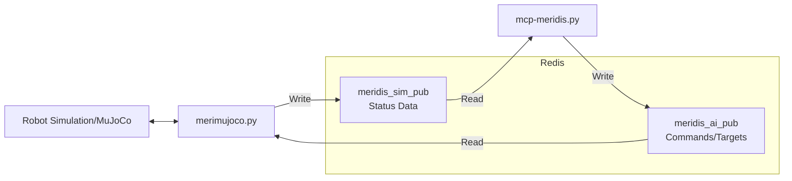
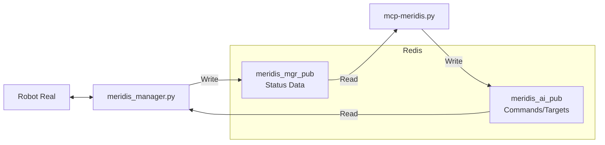
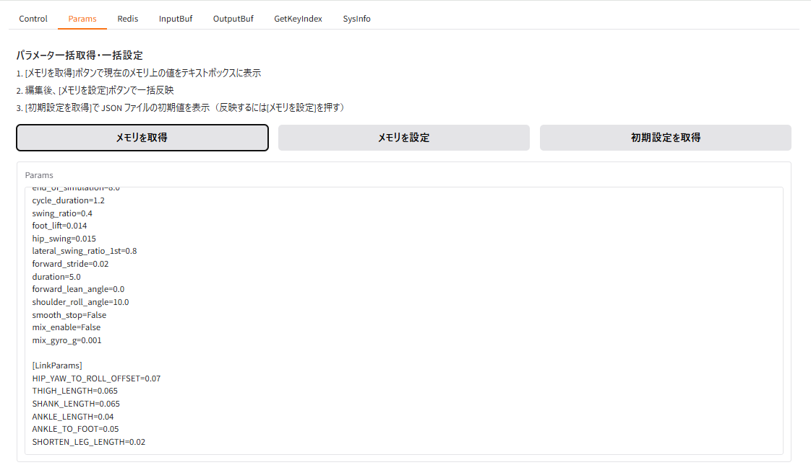
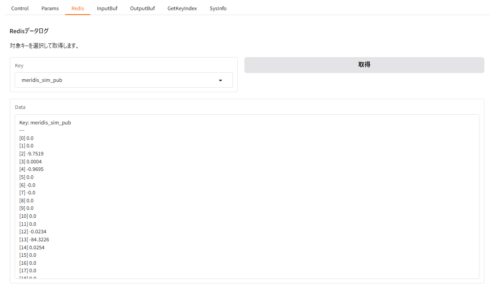
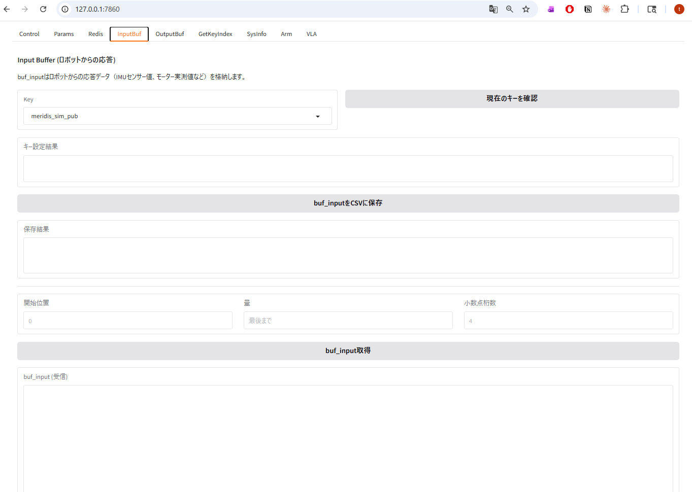
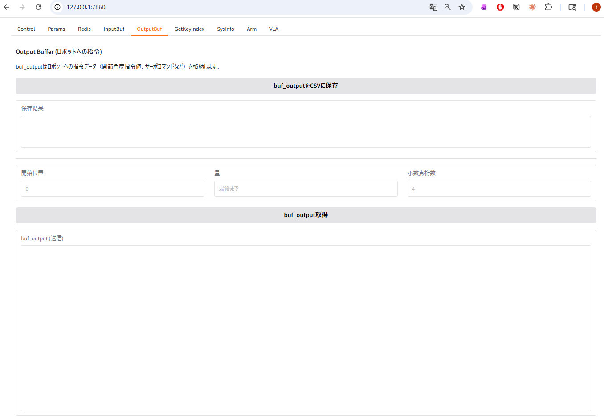
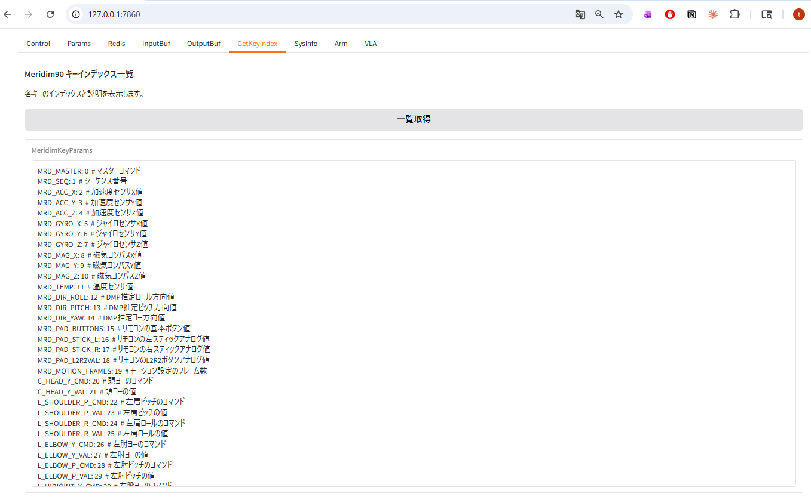
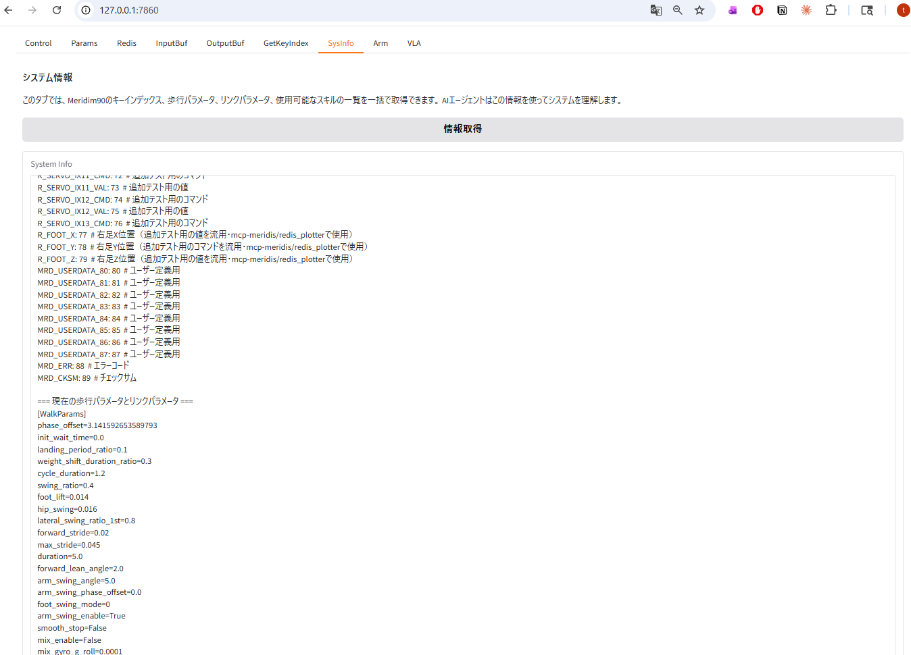
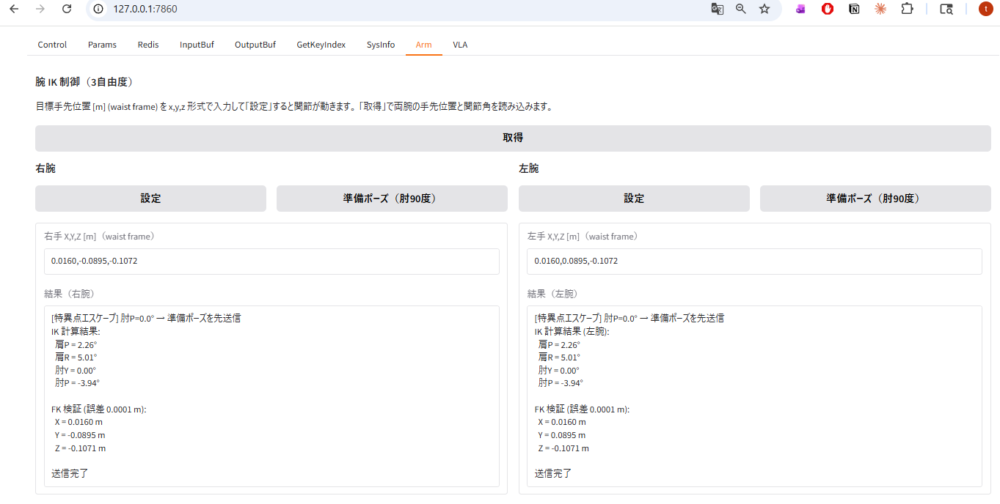
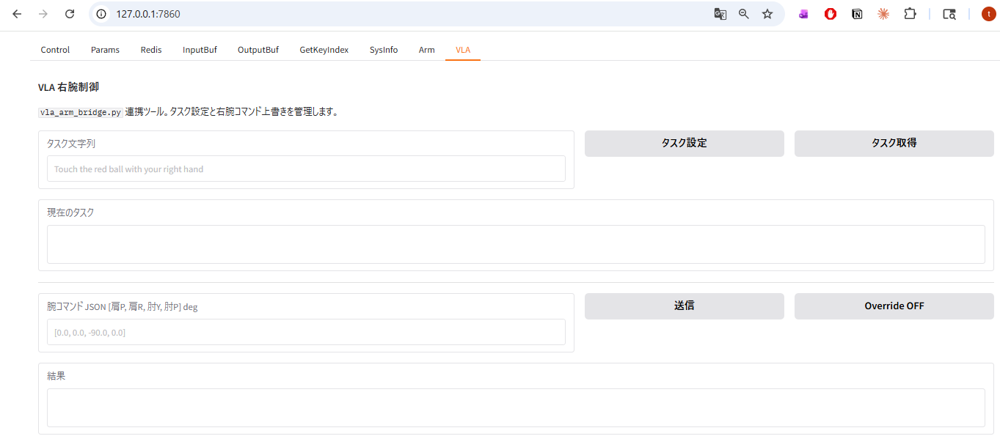

# mcp-meridis Advanced Operation Guide

English | [Japanese](README_advance.md)

For the Quick Start guide, see [README_EN.md](README_EN.md).

---

## Commands and Options

```bash
python mcp-meridis.py --redis REDIS_FILE --walkparam WALKPARAM_FILE --linkparam LINKPARAM_FILE
```

| Option | Default | Description |
|---|---|---|
| `--redis` | `redis.json` | Specifies the JSON configuration file that defines the Redis connection and keys |
| `--walkparam` | `walkparam.json` | Specifies the walking-parameter JSON file loaded at startup |
| `--linkparam` | `linkparam.json` | Specifies the link-parameter JSON file loaded at startup (defaults to `linkparam.json` when omitted) |

---

## Connection to Simulation: redis-sim.json

- Run the following in the mcp-meridis installation directory:

```bash
python mcp-meridis.py --redis redis-sim.json
```

- Run the following in the merimujoco installation directory:

```bash
python merimujoco.py --redis redis-ai.json
```

**Configuration file content**

```json
{
  "redis": {
    "host": "127.0.0.1",
    "port": 6379
  },
  "redis_keys": {
    "read": "meridis_sim_pub",
    "write": "meridis_ai_pub"
  }
}
```

- Read key: `meridis_sim_pub`, status data from the simulation side
- Write key: `meridis_ai_pub`, commands and target values sent from the server



---

## Connection to a Real Robot: redis-mgr.json

- Run the following in the mcp-meridis installation directory:

```bash
python mcp-meridis.py --redis redis-mgr.json
```

- Run the following in the meridis installation directory:

```bash
python meridis_manager.py --mgr mgr_ai2real.json --foot true
```

**Configuration file content**

```json
{
  "redis": {
    "host": "127.0.0.1",
    "port": 6379
  },
  "redis_keys": {
    "read": "meridis_mgr_pub",
    "write": "meridis_ai_pub"
  }
}
```

- Read key: `meridis_mgr_pub`, latest status data from the real-robot or manager side
- Write key: `meridis_ai_pub`, commands and target values sent from the server



---

## Web UI Operation Guide

Open `http://localhost:7860` or `http://127.0.0.1:7860/` in a browser to display the Web UI. This section summarizes the purpose of every tab and representative operations.

### Control Tab

The Home, Idle, Walk, Stop, Sysreset, and Status buttons provide control and status checks.

- **Home**: Move all joints to the zero-position home posture
- **Idle**: Move to the standby posture just before walking
- **Walk**: Start walking. The Duration field can specify the walking time in seconds
- **Stop**: Stop walking safely through in-place stepping. Behavior can be changed with the `smooth_stop` setting
- **Sysreset**: Send the system-reset signal
- **Status**: Display robot status, including state, time, walking phase, IMU information, and fall detection


### Params Tab

Use [Get Memory] to read current values, edit them, and then use [Set Memory] to apply them in one operation.  
Use [Get Initial Settings] to display the initial JSON values. To apply them, [Set Memory] is required.



### Redis Tab

Select a Redis key from the dropdown and display real-time data. The display is refreshed with the current key each time the tab is opened.

- **Get**: Display all Meridim90 data for the selected key
- **Get PAD**: Extract and display only the PAD controller values, buttons and analog sticks, from the same key



### InputBuf Tab

Select and switch the Redis key used as the received-data source. The current key is refreshed each time the tab is opened. The buffer contents can also be displayed and saved as CSV.



### OutputBuf Tab

Display and save the transmission-data buffer sent to the robot.



### GetKeyIndex Tab

Display the key-index list for the Meridim90 array.



### SysInfo Tab

Retrieve system-wide information in one operation. This is useful for AI agents.



### Arm Tab

This tab controls both arms with inverse kinematics. Enter the hand target position as `x,y,z` [m] in the waist frame. The system computes IK and sends joint angles.



| Button | Target | Action |
|---|---|---|
| **Get** | Both arms | Read current joint angles, VAL indices, from Redis, compute hand positions with forward kinematics, and display them. The current hand positions are also written to the text boxes |
| **Set** (right arm) | Right arm | Compute IK from the `X,Y,Z` text box, then send four axis angles, shoulder P / shoulder R / elbow Y / elbow P, to `meridis_ai_pub`. The result and FK validation error are displayed |
| **Prep Pose** (right arm) | Right arm | Send a safe posture with elbow flexed 90 degrees, shoulder P/R = 0 degrees, elbow Y = 0 degrees, elbow P = -90 degrees. Use this to escape singularities where the elbow is almost fully extended |
| **Set** (left arm) | Left arm | Same as the right arm. Compute left-arm IK and send the result |
| **Prep Pose** (left arm) | Left arm | Move the left arm to the same safe posture |

> **Singularity escape**: If the elbow P angle is within +/-8 degrees when pressing the Set button, meaning the elbow is almost fully extended, the system automatically sends the prep pose before sending the IK target angle. The result field displays `[Singularity Escape]`.

> **Coordinate frame**: waist frame, with X forward, Y left, and Z upward. The right-arm Y coordinate is negative, for example `0.10,-0.10,0.065`.

### VLA Tab

This Web UI integrates with the SmolVLA inference process. `vla_arm_bridge.py`, not public as of 2026.05, manages task instructions, task confirmation, and direct override of right-arm angle commands.



**Task management area**

| Button | Action |
|---|---|
| **Set Task** | Set the text entered in the text box to the global variable `vla_task` and display it in the current-task field. `vla_arm_bridge.py` polls this variable through the MCP tool `get_vla_task()`. When a new task is set, the inference instruction sent to SmolVLA changes |
| **Get Task** | Display the current string stored in `vla_task` in the current-task field. Use this to confirm which task the inference process is actually running |

**Arm command area**

| Button | Action |
|---|---|
| **Send** | Immediately send the JSON array `[shoulder P, shoulder R, elbow Y, elbow P]` in degrees as the right-arm angle command and set `arm_override_enabled = True`. After this, the 100 Hz control loop keeps overwriting indices [52-59] of `meridis_ai_pub` with this value every frame |
| **Override OFF** | Send the empty array `[]` to set `arm_override_enabled = False`. This stops overwriting the right arm from the control loop and returns the right arm to normal management by walking control and Arm-tab IK control |

> **How it works**: When overwrite is enabled with Send, the background control thread, running with a 10 ms period, keeps writing the `arm_override` value as the right-arm command every frame. `vla_arm_bridge.py` sends inference results here at 10 Hz through `set_arm_cmd()`, enabling SmolVLA to sequentially control the robot right arm. Because it runs concurrently during walking, the right arm can be VLA-controlled while walking.

> **Do not forget Override OFF**: If Override remains ON, right-arm commands are immediately overwritten even when pressing Set in the Arm tab. Always press Override OFF before switching to the Arm tab.

---

## Complete MCP Server Function List

Functions available from AI agents such as Claude and Cursor, 28 total:

### Robot Control

| Function | Arguments | Description |
|---|---|---|
| `robot_home()` | None | Move to the all-joints-zero home posture |
| `robot_idle()` | None | Move to the IDLE posture, standing posture just before walking |
| `robot_walk(duration)` | `duration` - walking time in seconds. If omitted, `params.duration` is used | Start robot walking |
| `robot_stop()` | None | Stop the robot. With `smooth_stop=True`, stop after the cycle completes. With `False`, stop immediately after in-place stepping |
| `system_reset()` | None | Send the system-reset signal, `data[0]=5556`, and release both-arm IK |
| `robot_status()` | None | Check robot status, including state, time, walking phase, IMU acceleration/gyro/attitude angle, and fall detection |

### Parameters

| Function | Arguments | Description |
|---|---|---|
| `getmrdkey()` | None | Get the Meridim90 key-index list |
| `get_params_text()` | None | Get current parameter text, WalkParams + LinkParams |
| `set_params_text(text)` | `text` - text in `[WalkParams]` / `[LinkParams]` section format | Set parameters in one operation |
| `get_initial_params_text()` | None | Get initial values from JSON files. To apply them to memory, `set_params_text` is required |
| `get_system_info()` | None | Get system information in one operation, useful for AI agents |

### Redis

| Function | Arguments | Description |
|---|---|---|
| `get_redis_data(key)` | `key` - Redis key name | Get all Meridim90 data for the specified Redis key |
| `get_pad_data(key)` | `key` - Redis key name | Get PAD controller values, buttons and analog sticks, from the specified Redis key |
| `set_redis_key_read(key)` | `key` - valid values: `meridis_sim_pub` / `meridis_ai_pub` / `meridis_calc_pub` / `meridis_mgr_pub` / `meridis_console_pub` | Change the received-data source `REDIS_KEY_READ`, applied immediately |
| `get_redis_key_read()` | None | Get the current receive Redis key and the key-ID list |

### Buffers

| Function | Arguments | Description |
|---|---|---|
| `get_buf_input(start, count, decimal, key)` | `start` - start position, `count` - number of samples, `decimal` - decimal places, `key` - Redis key. If omitted, the current `REDIS_KEY_READ` is used | Get received-data buffer |
| `get_buf_output(start, count, decimal)` | `start` - start position, `count` - number of samples, `decimal` - decimal places | Get transmission-data buffer |
| `filesave_buf_input()` | None | Save received data to `buf_input.csv` |
| `filesave_buf_output()` | None | Save transmission data to `buf_output.csv` |

### Arm IK Control

| Function | Arguments | Description |
|---|---|---|
| `arm_get_state()` | None | Get both arms' current joint angles, VAL, and hand positions, FK |
| `arm_set_position(xyz_str)` | `xyz_str` - `"x,y,z"` [m], waist frame | Compute and send IK from the right-hand target position, with singularity escape |
| `arm_prep_pose()` | None | Move the right arm to the prep pose, shoulder P/R = 0 degrees, elbow Y = 0 degrees, elbow P = -90 degrees |
| `left_arm_set_position(xyz_str)` | `xyz_str` - `"x,y,z"` [m], waist frame | Compute and send IK from the left-hand target position |
| `left_arm_prep_pose()` | None | Move the left arm to the prep pose |

### VLA Arm Control

| Function | Arguments | Description |
|---|---|---|
| `set_vla_task(task)` | `task` - task string | Set the VLA task. `vla_arm_bridge.py` polls it and uses it as the instruction for SmolVLA |
| `get_vla_task()` | None | Get the current VLA task string |
| `set_arm_cmd(values_str)` | `values_str` - `"[shoulder P, shoulder R, elbow Y, elbow P]"` [deg], or `"[]"` to disable | Override-send right-arm four-axis angles and enable `arm_override` |
| `arm_override_off()` | None | Disable `arm_override`, releasing the VLA/Override ON state |

---

## Prompt Examples

When Claude Desktop or Claude Code is connected to mcp-meridis, the following prompts can be entered as-is.

### Parameter Operations

| Prompt example | Expected effect |
|---|---|
| Please check the current walking parameters | Display all parameter names, current values, and descriptions |
| Please increase the walking speed | Adjust speed-related parameters and set them again |
| Please reduce the stride length and make it walk slowly | Change `stride_length` and related parameters, then start walking |

### Redis Key Operations

| Prompt example | Expected effect |
|---|---|
| Please check the current receive Redis key | Use `get_redis_key_read` to display the current key and valid key list |
| Please switch the receive key to meridis_mgr_pub | Apply `set_redis_key_read("meridis_mgr_pub")` immediately |

### Data Collection

| Prompt example | Expected effect |
|---|---|
| Please get the receive buffer | Display the latest received data from the robot |
| Please save the walking data to CSV | Save the receive and transmit buffers as CSV files |
| Please get all system information | Display parameters, Redis settings, status, and related information together |

### Arm IK Control

| Prompt example | Expected effect |
|---|---|
| Please get the current state of the right arm | Display both arms' joint angles and hand positions, FK |
| Please extend the right hand 10 cm forward, 10 cm to the right, at the same height as the waist | Run `arm_set_position("0.10,-0.10,0.065")` to compute and send IK |
| Please move the right arm to the prep pose | Run `arm_prep_pose()` and move to the safe elbow-90-degree posture |

### VLA Arm Control

| Prompt example | Expected effect |
|---|---|
| Please set the task "touch the red ball with the right hand" | Run `set_vla_task("touch the red ball with the right hand")` and pass it to vla_arm_bridge |
| Please check the current VLA task | Run `get_vla_task()` and display the current task string |
| Please stop VLA arm control | Run `set_arm_cmd("[]")` and disable arm_override |

### Composite Operations

| Prompt example | Expected effect |
|---|---|
| Move to the IDLE position, walk for 3 seconds, stop, and return to HOME | Execute IDLE -> walk for 3 seconds -> stop -> HOME in order |
| Check walking parameters, change stride_length to 0.03, then walk for 10 seconds | Check parameters -> change and set -> walk for 10 seconds in order |
| Check the status while walking, and when walking ends, save the buffer to CSV | Start walking -> check status -> save CSV in order |

---

## Gait Parameter Reference

Walking parameters are written in `walkparam.json` and loaded at startup. They can be changed while running through the MCP tool `set_params_text`, and current values can be checked with `get_params_text`.

### Timing and Cycle

| Parameter | Default | Description |
|---|---|---|
| `cycle_duration` | 1.2 s | Duration of one walking cycle |
| `swing_ratio` | 0.4 | Ratio of the swing-leg period within a cycle, 0.0-1.0 |
| `landing_period_ratio` | 0.1 | Ratio of the double-support period |
| `weight_shift_duration_ratio` | 0.30 | Ratio of the center-of-mass shift period. If small, the swing leg may rise before the center of mass fully moves onto the support leg |
| `init_wait_time` | 0.0 s | Wait time before walking starts |
| `phase_offset` | pi rad | Phase difference between left and right, pi = opposite phase |
| `duration` | 5.0 s | Walking duration |

### Posture and Trajectory

| Parameter | Default | Description |
|---|---|---|
| `foot_lift` | 0.014 m | Lift amount of the swing foot |
| `hip_swing` | 0.016 m | Lateral center-of-mass shift. If small, the shift onto the support leg is insufficient |
| `lateral_swing_ratio_1st` | 0.8 | Lateral-swing multiplier for the first step after walking starts |
| `forward_stride` | 0.02 m | Forward/backward stride length |
| `max_stride` | 0.045 m | Maximum forward/backward stride length |
| `forward_lean_angle` | 2.0 deg | Forward lean angle of the upper body, positive = forward lean. Thigh pitch and ankle pitch are adjusted by the same amount in opposite directions to preserve the sole contact angle |
| `foot_swing_mode` | 0 | Swing-foot trajectory mode, 0: sine wave, 1: cycloid |

### Arm Swing

| Parameter | Default | Description |
|---|---|---|
| `arm_swing_enable` | true | True: phase-linked shoulder-pitch arm swing / False: fixed shoulder pitch |
| `arm_swing_angle` | 5.0 deg | Arm-swing (shoulder-pitch) angle amplitude, effective only when `arm_swing_enable=True` |
| `arm_swing_phase_offset` | 0.0 rad | Arm-swing phase lead, phase adjustment to cancel angular momentum around the yaw axis |
| `arm_roll_angle` | 5.0 deg | Fixed shoulder-roll angle during walk, applied regardless of `arm_swing_enable` |

### Gyro Feedback

| Parameter | Default | Description |
|---|---|---|
| `mix_enable` | false | Enable gyro feedback. Superimposes IMU roll and pitch angular velocity on ankle angles |
| `mix_gyro_g_roll` | 0.0001 | Gyro gain coefficient for the roll axis. Larger values increase response to lateral sway |
| `mix_gyro_g_pitch` | 0.0002 | Gyro gain coefficient for the pitch axis. Larger values increase response to forward/backward sway, but beware of overcorrection |

### Stop Behavior

| Parameter | Default | Description |
|---|---|---|
| `smooth_stop` | false | True: automatically add one step on stop and transition to in-place stepping |

---

## Link Parameter Reference

`linkparam.json` is the configuration file that stores robot dimensions used for leg IK, arm IK, and ZMP estimation. In the Params tab and the MCP `get_params_text`, `LinkParams` for leg control are displayed. Arm IK and ZMP estimation also load additional arm and sole dimensions from the same JSON file.

### Leg IK and Walking Control

| Parameter | Description |
|---|---|
| `HIP_OFFSET_Y` | Y-direction offset from the waist center to the hip roll axis |
| `THIGH_LENGTH` | Thigh length |
| `SHANK_LENGTH` | Shin length |
| `ANKLE_LENGTH` | Ankle link length |
| `FOOT_OFFSET_Z` | Z-direction offset from the ankle roll axis to the sole |
| `FOOT_OFFSET_Y` | Y-direction offset from the ankle roll axis to the sole center |
| `SHORTEN_LEG_LENGTH` | Amount by which the legs are shortened in the standing posture |

### ZMP Estimation

| Parameter | Description |
|---|---|
| `FOOT_HALF_LEN` | Front/back half length of the sole support polygon |
| `FOOT_HALF_WIDTH` | Left/right half width of the sole support polygon |

### Arm IK

| Parameter | Description |
|---|---|
| `SHOULDER_OFFSET_X` | X-direction offset from the waist frame to the shoulder joint |
| `SHOULDER_OFFSET_Y` | Y-direction offset from the waist frame to the shoulder joint |
| `SHOULDER_OFFSET_Z` | Z-direction offset from the waist frame to the shoulder joint |
| `UPPER_ARM_LENGTH` | Upper-arm length |
| `LOWER_ARM_LENGTH` | Forearm length |

---

## File Structure

- Manuals
  - `README.md` ... Quick Start guide in Japanese
  - `README_EN.md` ... Quick Start guide in English
  - `README_advance.md` ... Advanced operation guide in Japanese
  - `README_advance_EN.md` ... This file, advanced operation guide in English

- Main files
  - `mcp-meridis.py` ... Main server, UI, and control logic
  - `walkparam.json` ... Initial walking-parameter values
  - `walkparam-fast.json` ... Walking-parameter preset for faster walking
  - `linkparam.json` ... Link length and offset parameters for legs, soles, arms, and head. Adjust these to match the real robot dimensions

- Libraries
  - `mrd_walk_ctrl.py` ... Walking-control logic, including WalkController and walking-parameter management
  - `mrd_arm_ctrl.py` ... Arm IK/FK library, including both-arm inverse kinematics, movable-range clamp, and Meridim index conversion
  - `mrd_info.py` ... Meridim90 array key definitions and system information
  - `redis_receiver.py` ... Data reception from Redis
  - `redis_transfer.py` ... Data transmission to Redis

- Tools
  - `redis_logger.py` ... Redis data logger triggered by PAD buttons, saved to `log/logs-*.csv`
  - `redis_plotter2.py` ... Real-time visualization of joint angles, foot positions, and ZMP
  - `eval_zmp.py` ... Sensorless ZMP evaluation library, `ZMPEstimator` class

---

## Installing Additional Packages

If you use `redis_plotter2.py`, also install libraries for plotting, spreadsheet-style data handling, and fitting:

```bash
pip install pandas matplotlib scipy
```

---

## Data Collection Tool: redis_logger.py

This standalone tool uses a PAD controller button as a trigger, collects data from Redis in real time, and saves it to `log/logs-YYYYMMDDHHMM.csv`.

### Usage

```bash
python redis_logger.py --btn 1                              # Record only while button value = 1
python redis_logger.py --btn 512 --redis redis-mgr.json    # Record with real-robot Redis settings
python redis_logger.py --btn 3 --interval 20               # Polling interval 20 ms
python redis_logger.py --btn 1 --redis-key meridis_sim_pub # Specify Redis key directly
```

### Options

| Option | Default | Description |
|---|---|---|
| `--btn` | Required | PAD button value used as the recording trigger, integer value of Meridim90[15] |
| `--redis` | `redis.json` | Redis connection configuration JSON file |
| `--redis-key` | `redis_keys.read` in JSON | Redis key name to read. If omitted, it is taken from JSON |
| `--interval` | `10.0` ms | Polling interval |

### Behavior

- Stores data in the buffer only while the button value matches `--btn`
- Automatically saves to `log/` when the button value changes or the upper limit, 10,000 rows, is reached
- Saves the remaining buffer even when interrupted with Ctrl+C
- The saved format is the same as `buf_input.csv`: raw Meridim90 data, no header, 90 columns

---

## Real-Time Visualization Tool: redis_plotter2.py

This standalone tool receives data from Redis and displays joint angles, foot positions, and ZMP as real-time graphs.

### Usage

```bash
python redis_plotter2.py                                    # Start with default settings, joint mode
python redis_plotter2.py --display foot                    # Foot-position mode
python redis_plotter2.py --display zmp                     # ZMP evaluation mode, eval_zmp.py required
python redis_plotter2.py --redis redis-mgr.json            # Redis settings for real robot
python redis_plotter2.py --window 10 --width 12 --height 8 # Adjust display window size
```

### Options

| Option | Default | Description |
|---|---|---|
| `--redis` | `redis.json` | Redis connection configuration JSON file |
| `--redis-key` | `redis_keys.read` in JSON | Redis key name to read |
| `--display` | `joint` | Display mode: `joint`, joint angles / `foot`, foot positions / `zmp`, ZMP evaluation |
| `--window` | `5.0` s | Time window displayed in the graph, seconds |
| `--width` | `8` | Graph width, inches |
| `--height` | `9` | Graph height, inches |
| `--log` | `off` | `on` enables data output to the console |

### Display Modes

| Mode | Content |
|---|---|
| `joint` | Display joint angles for the base link, IMU, right leg, and left leg as time-series graphs |
| `foot` | Display left and right foot positions, X/Z, as time-series graphs |
| `zmp` | Display PAD status, ZMP XY trajectory, ZMP time series, support-polygon margin, and Roll+Pitch. Requires `eval_zmp.py` |
