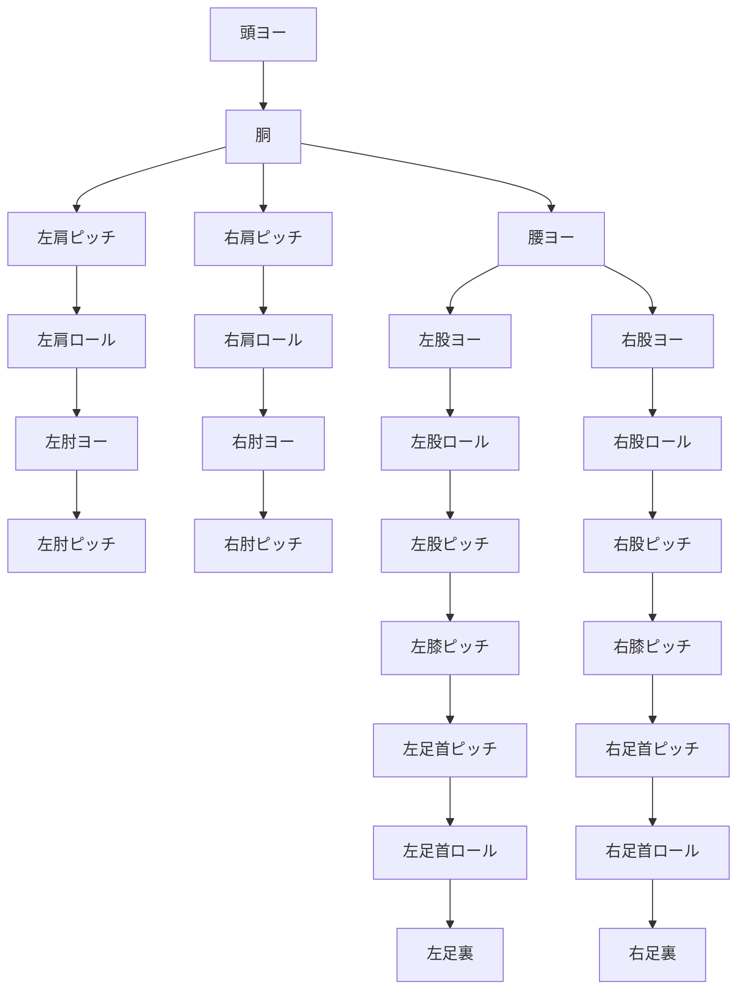

# mcp-meridis 二足歩行制御 要求仕様書

## 本文書の目的

本文書は、小型ヒューマノイドロボットの二足歩行を実現するソフトウェアに対する **要求仕様書**（何を達成すべきか）である。ロボット工学を学ぶ大学4年生から、フィジカルAI・ロボティクスAI の研究に着手しようとする研究者までを対象読者として想定している。

### 背景

フィジカルAI 研究（Genesis、Isaac Lab、π₀ 等）では、強化学習や模倣学習で歩容を獲得する手法が急速に発展している。一方で、学習された歩容を **実機で検証する環境** は依然として不足している。

本プログラム（mcp-meridis）は Meridian プロジェクトのエコシステム上で動作し、この課題に取り組んでいる。

> **Meridian プロジェクトのエコシステム**
>
> | コンポーネント | 開発者 | 役割 |
> |---|---|---|
> | [Meridian](https://meridian-oss.github.io/#project) | Ninagawa123 | ロボット通信ミドルプロトコル。ESP32 ボードと Meridim90 データ配列で 100 Hz の双方向通信を実現 |
> | [meridis](https://github.com/holypong/meridis) | holypong | Redis ベースのデータブリッジする仕組みで、シミュレータ/実機ロボット/MCPサーバ と接続 |
> | [merimujoco](https://github.com/holypong/merimujoco) | holypong | MuJoCo 物理シミュレーション。meridis 経由で Sim2Real / Real2Sim を提供 |
> | [mcp-meridis](https://github.com/holypong/mcp-meridis) | holypong | AI エージェントと連動するMCPサーバー。歩行動作におけるパラメータ調整/開始・停止の制御/歩行データ収集をプロンプトで指示 |

### 本プログラムの特徴

1. **デジタルツイン** — 本プログラムが出力する歩行指令は meridis 経由でそのままシミュレーションロボットまたは実機ロボットに送信でき、ロボットの応答値・IMU センサ値を同経路で取得できる
2. **古典制御から AI への接続** — IK ベースの歩容生成を起点に、merimujoco を利用したシミュレーション上の検証、模倣学習データの生成、Sim2Real / Real2Sim の比較までを一貫して行える。ここでは ZMP（Zero Moment Point）を **歩容の安定性を判断する検証指標** として位置づけ、歩行品質の定量評価に用いる。
3. **MCP による作業自動化** — AI エージェントとMCPの組合せで、歩行パラメータの設定・歩行の開始・歩行データの収集といった繰返し作業をプロンプトの指示だけで自動実行できる。

### 読み進め方

初期フェーズは **意図的な簡略化** を含んでおり、これらは不具合ではなく段階的に解消すべき設計上の近似である。各フェーズの理論的背景を理解した上で実装・実験を進めることで、基礎理論からフィジカルAI 研究への道筋を体験できる構成としている。

---

## 目次

- [適用範囲と前提条件](#適用範囲と前提条件)
- [理論的背景（各フェーズ共通）](#理論的背景各フェーズ共通)
- [P0：前提知識と環境構築](#p0前提知識と環境構築)
- [P1：静的姿勢保持と逆運動学](#p1静的姿勢保持と逆運動学)
- [P2：準静的歩行（1 歩の実現）](#p2準静的歩行1-歩の実現)
- [P3：周期歩行パターンの生成](#p3周期歩行パターンの生成)
- [P4：歩行状態遷移と安全な開始・停止](#p4歩行状態遷移と安全な開始停止)
- [P5：MCP によるパラメータ調整と歩行データ収集](#p5mcp-によるパラメータ調整と歩行データ収集)
- [P6：遊脚軌道改善と腕振り制御](#p6遊脚軌道改善と腕振り制御)
- [P7：IMU センサフィードバック（ジャイロミキシング）](#p7imu-センサフィードバックジャイロミキシング)
- [P8：ZMP 解析による定量的評価](#p8zmp-解析による定量的評価)
- [P9：フィジカルAI 連携（模倣学習・Sim-to-Real）](#p9フィジカルai-連携模倣学習sim-to-real)
- [P10：発展的研究テーマ](#p10発展的研究テーマ)
- [現行実装の評価と次のステップ](#現行実装の評価と次のステップ)
- [対象ロボットの物理仕様](#対象ロボットの物理仕様)
- [用語集](#用語集)
- [参考文献](#参考文献)

---

## 適用範囲と前提条件

### 適用範囲

本仕様は以下のスコープを対象とする。

- 平坦な床面上での前進直線歩行
- 歩行速度は低速（秒速数 cm オーダー）
- 通信は Meridim90 プロトコル（90 要素 float 配列）を使用し、制御周期 10 ms（100 Hz）で動作する

### 対象外（将来の拡張候補）

- 階段昇降、斜面歩行
- 走行（両足同時離地を伴う運動）
- 外部からの大きな外乱への対処

### 前提条件

- 読者はロボット工学の基礎（座標変換、剛体力学）を履修済みであること
- Python と NumPy を用いた数値計算の基礎知識があること
- 対象ロボットのリンク長・関節構成は「対象ロボットの物理仕様」の章に記載の通りとする

---

## 理論的背景（各フェーズ共通）

本章では、各フェーズの要求を理解するために必要な理論を概説する。
詳細は「参考文献」の章を参照されたい。

### 二足歩行の基本問題

二足歩行ロボットは、人間と異なり受動的な安定性を持たない。
すなわち、制御入力がなければ倒れてしまう **静的に不安定なシステム** である。

歩行を実現するには、次の 3 つの問題を同時に解く必要がある。

1. **姿勢生成問題**: 各時刻で各関節をどの角度にするか（運動学）
2. **安定性問題**: 生成した運動がロボットを転倒させないか（力学）
3. **軌道追従問題**: 計画した運動を実機で実現できるか（制御）

### 逆運動学（Inverse Kinematics）

足先の目標位置 $\boldsymbol{p} = (x, y, z)$ が与えられたとき、
それを実現する関節角度 $\boldsymbol{q} = (q_1, q_2, \dots, q_n)$ を求める問題を
**逆運動学（Inverse Kinematics, IK）** と呼ぶ。

6 自由度の脚であれば、幾何学的関係から閉形式（解析的）に解くことが可能であり、
計算コストが低く実時間制御に適している。

### 安定性の指標 —— 支持多角形と ZMP

#### 支持多角形（Support Polygon）

ロボットが床面と接触しているすべての点で構成される凸包を **支持多角形** と呼ぶ。
両足接地時は両足裏を含む広い領域、片足支持時は片足裏のみの狭い領域となる。

#### 重心（Center of Mass, CoM）

ロボット全体の質量分布から求まる重心位置。
静的な場合、CoM の床面への射影が支持多角形内にあれば転倒しない。

#### ZMP（Zero Moment Point）

動的な運動を行うとき、慣性力を考慮した「力学的な重心射影」が ZMP である
（Vukobratović, 1972）。ZMP が支持多角形内にある限り、
ロボットは床面から回転モーメントを受けない（＝転倒しない）。

$$
\boldsymbol{p}_{\text{ZMP}} = \frac{\sum_i m_i (\ddot{z}_i + g) \boldsymbol{p}_i^{xy} - \sum_i m_i \ddot{\boldsymbol{p}}_i^{xy} z_i}{\sum_i m_i (\ddot{z}_i + g)}
$$

教科書的な歩行制御では、ZMP が常に支持多角形内に留まるように軌道を計画する。

### 歩行周期の基本構造

一般的な二足歩行は、以下のフェーズで構成される 1 つの **歩行周期** の繰り返しである。

| 両脚支持期（Double Support） | 片脚支持期（Single Support） |
|---|---|
| 両足が接地 | 支持脚で体を支える |
| 重心を次の支持脚方向へ移動 | 遊脚を振り出す |
| | 足先を持ち上げ着地点へ運ぶ |

歩行周期の中で **支持脚と遊脚が左右入れ替わる** ことで連続的な前進が実現する。

### 遊脚軌道の代表的な生成方法

| 手法 | 概要 | 特徴 |
|---|---|---|
| 正弦波 (sin) | $h(t) = h_{\max} \sin(\pi \cdot \phi)$ | 最も単純。着地衝撃がやや大きい |
| サイクロイド | 車輪の縁の軌跡を模した曲線 | 着地速度が 0 になり衝撃が小さい |
| 多項式補間 | 5 次以上の多項式で始点・終点の位置・速度・加速度を拘束 | 自由度が高く設計しやすい |

---

## P0：前提知識と環境構築

### 目的

歩行アルゴリズムを実装・検証するためのソフトウェア環境を整備し、
ロボットとの通信が正常に行えることを確認する。

### 要求事項

| ID | 要求 | 検証方法 |
|---|---|---|
| P0-1 | Python 実行環境で NumPy を用いた行列演算が実行できること | 単体テスト |
| P0-2 | Meridim90 形式のデータ配列（90 要素 float）を生成し、通信経路（Redis）を介してロボットに送信できること | 通信テスト |
| P0-3 | ロボットから受信したセンサデータ（IMU 値等）を読み取れること | 通信テスト |
| P0-4 | 対象ロボットの関節構成（「対象ロボットの物理仕様」の章）とリンク長を理解し、JSON ファイルからパラメータを読み込めること | レビュー |
| P0-5 | meridis の Redis キー構成（`meridis_sim_pub`, `meridis_calc_pub`, `meridis_mcp_pub` 等）を理解し、Redis 設定ファイル（`redis.json`）からホスト・ポート・使用キーを読み込めること | 通信テスト |

---

## P1：静的姿勢保持と逆運動学

### 目的

ロボットが倒れずに **その場に立ち続ける** ことを実現する。
これは歩行の最も基本的な前提条件であり、逆運動学の理解と実装を行う。

### 理論的背景

#### 幾何学的逆運動学

本ロボットの脚は左右各 6 自由度（股ヨー / 股ロール / 股ピッチ / 膝ピッチ / 足首ピッチ / 足首ロール）で構成される。

足先目標位置 $(x, y, z)$ が与えられたとき、矢状面（前後・上下の面）では
大腿リンク長 $L_1$ と下腿リンク長 $L_2$ の **2 リンクモデル** として
余弦定理により膝角度を求め、続いて股ピッチと足首ピッチを導出できる。

前額面（左右・上下の面）では、股ロール角を $\text{atan2}$ で直接計算し、
足首ロールで水平を補正する。

#### 膝を曲げた姿勢の必要性

完全に膝を伸ばした状態（特異姿勢）では逆運動学が解けなくなる。
そのため、立位でもわずかに膝を曲げた姿勢を取る必要がある。
リンク長の合計より短い目標脚長を設定することで、これを実現する。

### 要求事項

| ID | 要求 | 検証方法 |
|---|---|---|
| P1-1 | 足先の目標位置 $(x, y, z)$ を入力として、脚の 6 関節角度を幾何学的に算出する逆運動学関数を実装すること | 単体テスト：既知の入出力ペアとの一致確認 |
| P1-2 | 目標脚長はリンク全長より短く設定し、膝を曲げた姿勢で立てること（特異姿勢の回避） | 計算結果で膝角度 > 0 を確認 |
| P1-3 | 左右両脚に同一の直下目標位置を与えた状態で、ロボットが自重により転倒しないこと | 実機テスト：5 秒以上の姿勢保持 |
| P1-4 | IK の計算結果を Meridim90 データ配列に書き込み、ロボットに送信できること | 通信テスト＋実機動作確認 |
| P1-5 | 目標位置がロボットの到達可能範囲を超える場合に、安全に検出して処理を中断すること | 異常入力テスト |

---

## P2：準静的歩行（1 歩の実現）

### 目的

**両脚支持 → 重心移動 → 片脚支持（遊脚振り出し）→ 着地** の一連の動作を
転倒せずに 1 歩だけ実行できるようにする。

歩行の本質的な難しさ ——「片足で立つ間にもう一方の足を前に出す」——
に最もシンプルな形で取り組むフェーズである。

### 理論的背景

#### 重心移動の必要性

両足で立っている状態から片足を上げるには、まず **重心を支持脚側に移す** 必要がある。
重心の床面射影が支持脚の支持多角形内になければ、足を上げた瞬間に転倒する。

本ロボットのように足裏が小さい場合、横方向の重心移動がとくに重要となる。
股関節ロール軸を用いて骨盤（上体）を支持脚側に傾けることで、
近似的に CoM を支持多角形内に移動させる。

#### 遊脚軌道の最低限の要件

- 遊脚は **床面から十分に離れて** 振り出すこと（引っかかり防止）
- 着地時の衝撃を抑えるため、**着地直前の下降速度が小さい** ことが望ましい

### 要求事項

| ID | 要求 | 検証方法 |
|---|---|---|
| P2-1 | 横方向の重心移動機能を実装すること。股関節ロール軸を用いて、足先目標位置の Y 座標をオフセットさせることで CoM を近似的に支持脚側に移動させること | 関節角度のプロット確認 |
| P2-2 | 遊脚を床面から持ち上げ、前方に運び、着地させる軌道を生成できること。最初の実装では正弦波プロファイルで十分とする | 足先 Z 座標の時系列プロット |
| P2-3 | 前後方向の足先移動を生成できること（1 歩分の歩幅を正弦波等で実現） | 足先 X 座標の時系列プロット |
| P2-4 | 上記の動作を組み合わせ、1 歩の前進動作をロボットが転倒せずに完了できること | 実機テスト |
| P2-5 | 重心移動量（横スイング量）および遊脚高さは、パラメータとして外部から変更可能であること | パラメータ変更後の動作確認 |

---

## P3：周期歩行パターンの生成

### 目的

P2 で実現した 1 歩の動作を **左右交互に連続して繰り返し**、
持続的な前進歩行を実現する。

### 理論的背景

#### 位相ベースの歩行パターン生成

連続歩行を実現する最も基本的な方法は、
時間 $t$ から **位相** $\phi$ を計算し、位相に基づいて各軌道を生成する手法である。

$$
\phi(t) = \frac{2\pi \cdot t}{T_{\text{cycle}}}
$$

ここで $T_{\text{cycle}}$ は歩行 1 周期の時間である。
左右の脚には **位相差** $\Delta\phi = \pi$（半周期分のずれ）を与えることで、
左右交互の運動が自然に生成される。

各軌道成分は以下のように位相の関数として表現できる。

- **横方向スイング**: $y_{\text{swing}}(\phi) = A_y \sin(\phi)$
  - 左右の重心移動を正弦波で繰り返す
- **遊脚高さ**: $z_{\text{lift}}(\phi)$ — 位相の特定区間（遊脚期）で足を持ち上げる
- **前後移動**: $x_{\text{stride}}(\phi) = A_x \sin(\phi)$

#### 遊脚期間と支持期間の比率

周期の中で足を上げている期間（遊脚期）と床に着けている期間（支持期）の比率は
歩行の安定性に大きく影響する。一般に、遊脚期が短いほど両脚支持の時間が長くなり、
安定性が高まるが、歩行速度や自然さとのトレードオフとなる。

### 要求事項

| ID | 要求 | 検証方法 |
|---|---|---|
| P3-1 | 時間 $t$ から位相 $\phi$ を計算し、位相に基づいて横スイング・遊脚高さ・前後移動の各軌道を生成する関数を実装すること | 各軌道の時系列プロット（2 周期以上） |
| P3-2 | 左右の脚に位相差 $\pi$ を与え、左右交互の歩行動作を生成すること | 左右の遊脚高さが半周期ずれていることの確認 |
| P3-3 | 以下のパラメータを外部ファイルから調整可能とすること：歩行周期 $T_{\text{cycle}}$、横スイング量 $A_y$、遊脚高さ $h_{\max}$、歩幅 $A_x$、遊脚期間比率 | パラメータ変更による動作変化の確認 |
| P3-4 | 制御周期 10 ms（100 Hz）で各フレームの関節角度を計算し、遅延なくロボットに送信できること | 処理時間の計測 |
| P3-5 | 連続歩行中にロボットが転倒せず、3 周期以上の前進を継続できること | 実機テスト |

---

## P4：歩行状態遷移と安全な開始・停止

### 目的

歩行の **開始・停止の遷移** を安全に行えるようにする。
急激な動作開始や即時停止は転倒の原因となるため、
歩行状態を段階的に遷移させる状態機械（State Machine）を構築する。

### 理論的背景

#### 歩行状態遷移の必要性

実際の二足歩行では、以下の理由から段階的な遷移が必要となる。

1. **開始時**: 静止状態からいきなり遊脚を上げると、重心が支持脚側に移っていないため転倒する。まず重心移動のみを行い、十分に重心が移動してから遊脚動作を開始する。
2. **停止時**: 歩行中に突然停止すると、慣性力により前方に倒れる。最低限、両足が接地している位相で停止し、必要なら減速シーケンスを挿入する。

#### 状態機械の考え方

歩行全体を有限個の **状態（State）** に分割し、時間や条件に応じて
状態を遷移させる。各状態で有効な制御内容を切り替えることで、
安全な歩行シーケンスを実現する。

### 要求事項

| ID | 要求 | 検証方法 |
|---|---|---|
| P4-1 | 歩行を以下の状態に分割する状態機械を実装すること：(a) 初期待機、(b) 両足着地安定期、(c) 重心移動開始期、(d) 定常歩行 | 状態遷移ログの確認 |
| P4-2 | 重心移動開始期では横スイングのみ行い、遊脚は上げないこと。定常歩行に遷移してから初めて脚を振り出すこと | 各状態での動作の目視確認 |
| P4-3 | 歩行停止指令を受けたとき、安全な姿勢（両足接地・膝屈曲の直立姿勢）に復帰すること | 停止後の姿勢確認 |
| P4-4 | 各状態の継続時間（着地期間比率、重心移動期間比率等）をパラメータとして外部から調整可能であること | パラメータ変更後の遷移タイミング確認 |
| P4-5 | すべての状態で IK の計算結果がロボットへのコマンドとして反映されること（計算だけして送信しない状態があってはならない） | 各状態のデータ出力ログ確認 |

---

## P5：MCP によるパラメータ調整と歩行データ収集

### 目的

P4 で安定した歩行状態遷移が実現した。次のステップとして、センサフィードバックを加える **前** に、現在のオープンループ歩行のパラメータを体系的に調整し、最良の基準歩容を確立する。MCP サーバー機能を活用して、AI エージェントがパラメータ変更・実験実行・データ収集を自動的に繰り返す研究サイクルを構築する。

### 理論的背景

#### パラメータ感度と実験計画

歩行アルゴリズムには歩行周期・遊脚高さ・横スイング量・歩幅など複数のパラメータがある。各パラメータが歩行品質（安定性・速度・自然さ）に与える影響を理解するには、**一度に一つのパラメータを変化させながら実験を繰り返す** 基本的な感度分析が有効である。

MCP サーバー機能により、AI エージェントが「パラメータ設定 → 歩行実行 → データ取得」のループをプログラム的に制御できるため、人手による繰り返し作業を大幅に削減できる。

### 要求事項

| ID | 要求 | 検証方法 |
|---|---|---|
| P5-1 | MCP ツール経由で `walkparam-s1.json` の歩行パラメータを読み書きし、即座に歩行動作に反映できること | パラメータ変更後の動作変化の確認 |
| P5-2 | 歩行データ（指令値 `buf_output`・実機応答値 `buf_input`）を CSV ファイルに保存し、後からオフライン解析できること | CSV ファイルの内容確認 |
| P5-3 | 主要パラメータ（`cycle_duration`・`foot_lift`・`hip_swing`・`forward_stride`）を段階的に変化させた複数の実験データを記録・比較できること | パラメータごとのデータ比較 |
| P5-4 | AI エージェント（MCP 経由）が「パラメータ変更 → 歩行実行 → データ取得」のサイクルを自動で繰り返せること | エージェントによる自律実験の実行確認 |

---

## P6：遊脚軌道改善と腕振り制御

### 目的

P5 で最良の基準パラメータを確立した後、オープンループ歩行そのものの品質を向上させる。遊脚の軌道形状を改良して着地衝撃を低減し、腕振りによる角運動量補償を加える。

### 理論的背景

#### 遊脚軌道の形状と着地衝撃

現行の正弦波遊脚軌道は着地直前に下降速度が残るため、着地時に衝撃が発生する。

| 手法 | 着地直前速度 | 実装コスト |
|---|---|---|
| 正弦波（現行） | ゼロでない | 低 |
| サイクロイド | ゼロ | 中 |
| 5 次多項式 | ゼロ（加速度も拘束可能） | 中 |

#### 腕振りによる角運動量補償

歩行中、脚の振り出しにより発生するヨー軸周りの角運動量を、腕を **逆位相**（位相差 $\pi$）で振ることで打ち消す。人間の自然な歩行でも同様の機構が見られる（Kajita et al., 2003）。

$$
\phi_{\text{arm}}(t) = A_{\text{arm}} \sin\!\left(\frac{2\pi t}{T_{\text{cycle}}} + \pi\right)
$$

### 要求事項

| ID | 要求 | 検証方法 |
|---|---|---|
| P6-1 | サイクロイド軌道または 5 次多項式軌道を実装し、正弦波との着地衝撃差を IMU の加速度ピーク値で比較できること | ON/OFF 切り替えでの IMU ログ比較 |
| P6-2 | 歩行位相と逆位相（位相差 $\pi$）で肩ロール軸を振る腕振り制御を実装すること | 関節角度の時系列プロット確認 |
| P6-3 | 腕振りの振幅（`shoulder_roll_angle`）はパラメータとして外部から調整可能であること | パラメータ変更テスト |

---

## P7：IMU センサフィードバック（ジャイロミキシング）

### 目的

P5〜P6 でオープンループ歩行の品質を高めた後、初めてセンサフィードバックを導入する。IMU（慣性計測ユニット）の角速度データを用いたジャイロミキシングにより、外乱に対してロバストなクローズドループ制御を実現する。

### 理論的背景

#### オープンループとクローズドループの違い

P3〜P6 の歩行は、計画した軌道をそのまま再生する **オープンループ制御** である。床面の凹凸・サーボ応答遅れ・リンク長誤差などにより姿勢がずれても修正されない。

**クローズドループ制御**（フィードバック制御）では、センサから得た実際の姿勢情報を用いてリアルタイムに指令を修正する。

#### ジャイロミキシング

最も簡易なフィードバック手法。角速度センサの値にゲインを乗じて足首の関節角度に加算し、傾きを打ち消す方向に補正する。

$$
\Delta q_{\text{ankle}} = K_p \cdot \omega_{\text{gyro}}
$$

比例ゲイン $K_p$ のみの単純な構造だが、小型ロボットでは実用的な安定化効果をもつ。

### 要求事項

| ID | 要求 | 検証方法 |
|---|---|---|
| P7-1 | IMU のロール軸・ピッチ軸の角速度データを制御ループ内で読み取れること | センサデータのログ確認 |
| P7-2 | ジャイロミキシングを実装し、ロール軸の角速度に比例ゲインを乗じて足首ロール角に加算できること | フィードバック ON/OFF での姿勢安定性の比較実験 |
| P7-3 | フィードバックの ON/OFF をパラメータで切り替え可能であること | パラメータ変更テスト |
| P7-4 | ジャイロミキシングがどの関節にどの程度影響するかを定義するミキシング行列を、設定として外部から変更可能であること | 設定変更テスト |

---

## P8：ZMP 解析による定量的評価

### 目的

P5 以降で収集したデータを用いて、歩行安定性を ZMP 理論で定量的に検証する。目視確認だけでは判断できない安定性の根拠をデータで示す。

### 理論的背景

#### ZMP の計算

$n$ 個のリンクから成るロボットの ZMP は次式で推定できる（各リンクの質量 $m_i$、重心加速度 $\ddot{\boldsymbol{p}}_i$、重力加速度 $g$）。

$$
\boldsymbol{p}_{\text{ZMP}} = \frac{\sum_i m_i (\ddot{z}_i + g) \boldsymbol{p}_i^{xy} - \sum_i m_i \ddot{\boldsymbol{p}}_i^{xy} z_i}{\sum_i m_i (\ddot{z}_i + g)}
$$

実装上は、各リンクの質量を等分配と仮定した簡易モデルから `buf_output` の関節角度列を用いてオフラインで推定する。

### 要求事項

| ID | 要求 | 検証方法 |
|---|---|---|
| P8-1 | `buf_output` の関節角度列から ZMP 軌道を推定する Python スクリプトを作成できること | スクリプト実行結果の確認 |
| P8-2 | ZMP 軌道と支持多角形の関係を時系列グラフで可視化できること | グラフの目視確認 |
| P8-3 | パラメータ変更前後の ZMP 軌道を比較し、安定性の定量的な差異を示せること | 複数条件のグラフ比較 |

---

## P9：フィジカルAI 連携（模倣学習・Sim-to-Real）

### 目的

P5〜P8 で整備した歩行基盤とデータ収集環境を活かし、フィジカルAI 研究へのパイプラインを構築する。本システムが生成する実機検証済みの歩容を模倣学習のデモデータとして活用し、強化学習エージェントとの双方向連携を実現する。

### 理論的背景

#### 模倣学習（Behavior Cloning）

専門家のデモンストレーションデータから方策を学習する手法。本仕様では IK ベースの周期歩容（理論的に導出された安定歩容）を「専門家デモ」として扱い、強化学習エージェントの初期方策や学習データとして利用する。

#### Sim-to-Real ギャップ

シミュレーションで学習した方策を実機に転移する際、シミュレーションと現実の物理特性の差異（摩擦・質量分布・アクチュエータ応答等）により性能が低下する現象。merimujoco は MuJoCo 上で Roid1 モデルを用いた Sim2Real / Real2Sim をすでに実現しており、meridis の Redis ブリッジを通じてシミュレーション歩容と実機歩容の同時比較が可能である。加えて meridis は Genesis AI・Isaac Sim にも対応するため、複数シミュレータ間での Sim-to-Real ギャップの横断的評価も視野に入る。

### 要求事項

| ID | 要求 | 検証方法 |
|---|---|---|
| P9-1 | 指令値・実機応答値・IMU センサ値を模倣学習（Behavior Cloning）の入力フォーマットに整形してファイル出力できること | 出力ファイルのフォーマット確認 |
| P9-2 | merimujoco（MuJoCo）のシミュレーション歩容を meridis 経由で実機に転送し再生できること（Sim2Real）。逆に実機歩容をシミュレーション上に取り込めること（Real2Sim） | 実機動作と merimujoco 上の動作の同期確認 |
| P9-3 | シミュレーション歩容と実機歩容の差異（関節角度差・ZMP 差）を定量的に比較し、Sim-to-Real ギャップを評価できること | P8 のスクリプトを用いた比較グラフ |

---

## P10：発展的研究テーマ

### 目的

P9 までの基盤を活かして、より高度な歩行制御と応用研究テーマに取り組む。各テーマは独立しており、関心と優先度に応じて選択・実施する。

### 要求事項

| ID | テーマ | 要求 | 期待される効果 | 参考手法 |
|---|---|---|---|---|
| P10-A | 方向転換 | 股ヨー軸の角度を歩行位相に応じて変化させ、旋回歩行を実現すること | 直進以外の移動能力の追加 | — |
| P10-B | 高度な安定化制御 | PD 制御、LQR、またはパッシブダイナミクスに基づくバランス制御を検討・実装すること | ジャイロミキシングを超える外乱耐性 | Kajita & Espiau (2008) |
| P10-C | CPG ベース歩行 | 中枢パターン生成器（Central Pattern Generator）を用いた歩行パターン生成を検討すること | 環境適応的な歩行リズムの自律生成 | Ijspeert (2008) |

---

## 現行実装の評価と次のステップ

本章では、現在の実装（`meri_walk_ctrl.py`）が上記の各フェーズの要求をどの程度
満たしているかを評価し、次に取り組むべき課題を明確にする。

### 達成状況一覧

| フェーズ | テーマ | 達成度 | 評価の根拠 |
|---|---|---|---|
| **P0** | 環境構築 | **達成** | Meridim90 配列の生成・meridis Redis キー（`meridis_mcp_pub` / `meridis_sim_pub`）経由の送受信・JSON パラメータ読み込みが動作している |
| **P1** | 静的姿勢保持・IK | **達成** | `geometric_leg_ik()` で余弦定理ベースの閉形式 IK を実装済み。膝屈曲姿勢での直立が可能。到達不可検出も実装されている |
| **P2** | 準静的歩行（1 歩） | **達成** | 横スイング（`hip_swing`）・遊脚持ち上げ（`calculate_foot_height`）・前後移動（`calculate_forward_motion`）を組み合わせた 1 歩動作が動作する |
| **P3** | 周期歩行パターン | **達成** | 位相ベース（`phase_y`, `phase_z`）の連続歩行を実装済み。左右位相差 $\pi$ による交互歩行が動作する。パラメータは JSON で外部調整可能 |
| **P4** | 状態遷移 | **達成** | 4 状態の状態機械（`w_sts` 0〜3）を実装済み |
| **P5** | MCP パラメータ調整 | **基盤のみ** | MCP サーバーは稼働中。歩行パラメータの読み書きは可能だが、体系的な感度分析・自動実験サイクルは未実施 |
| **P6** | 遊脚軌道・腕振り | **未着手** | 遊脚は正弦波のみ。腕は固定角度（`shoulder_roll_angle`）で歩行位相と非連動 |
| **P7** | IMU フィードバック | **基盤のみ** | ジャイロミキシングのコードは存在するが、デフォルト無効（`mix_enable=false`） |
| **P8** | ZMP 解析 | **未着手** | ZMP 推定スクリプト・可視化ツールともに未実装 |
| **P9** | フィジカルAI 連携 | **基盤あり** | merimujoco / meridis によるシミュレーション接続基盤は稼働中（`meridis_sim_pub` 読み取り済み）。模倣学習データの整形・Sim-to-Real の定量評価パイプラインは未実装 |
| **P10** | 発展的研究 | **未着手** | 方向転換・高度安定化・CPG 等、すべて将来課題 |

### 既知の不具合

不具合を見つけた場合に、記載する。

### 設計上の近似と限界

現在の実装は P1〜P3 の教科書的アプローチに基づいており、
いくつかの **意図的な簡略化** を含んでいる。
これらは不具合ではなく、今後の改善で段階的に解消すべき設計上の近似である。

| # | 近似内容 | 影響 | 改善の方向性 |
|---|---|---|---|
| S1 | **CoM を直接制御していない** — 横スイングは足先 Y 座標のオフセットで実現しており、重心位置を力学的に計算していない | 歩行速度を高くすると ZMP が支持多角形から外れる可能性がある | ZMP 推定の導入（P8） |
| S2 | **足首ロール補正が等分配** — `hip_roll` と `ankle_roll` に目標ロール角を 50:50 で分配している | 厳密には接地面の法線方向に基づく補正が必要。現状の低速歩行では実害は小さい | DH パラメータによる完全 IK の検討 |
| S3 | **`ANKLE_LENGTH` が IK に含まれない** — IK は大腿＋下腿の 2 リンクで解いており、足首ピッチ〜足首ロール間のリンク長は無視されている | 足裏の実際の位置に数 cm の誤差が生じる | 3 リンク IK への拡張 |
| S4 | **股ヨー角が常に 0** — 方向転換機能がない | 直進歩行にしか対応できない | 要求 P10-A の実装 |
| S5 | **腕は固定角度** — 肩ロールが `shoulder_roll_angle`（デフォルト 10°、`walkparam-s1.json` で調整可能）の固定値で、歩行位相と連動していない | 脚の振り出しで発生するヨー軸の角運動量が補償されず、上体がわずかに回旋する | 要求 P6-2 の実装（位相連動の腕振りへ拡張） |
### エコシステム連携の未活用ポイント

現在の実装は meridis を通じた基本的な送受信を実現しているが、
merimujoco / meridis エコシステムの能力をまだ十分に活用していない。

| # | 未活用領域 | 現状 | 活用の方向性 |
|---|---|---|---|
| E1 | **シミュレーション並行検証** | 歩行アルゴリズムは実機のみで検証している | merimujoco 上で事前に歩容を検証し、パラメータを絞り込んでから実機テストに移行する。P5〜P6 の効率が大幅に向上する |
| E2 | **Real2Sim によるモデル較正** | シミュレーションと実機の対応を取っていない | 実機の応答を merimujoco に取り込み、シミュレーションモデルのパラメータ（摩擦・サーボ応答）を較正する |
| E3 | **デジタルツイン同期** | merimujoco のリアルタイム同期機能を使用していない | 歩行中の実機状態を merimujoco で3D 可視化し、ZMP 解析と同時に行う（P8 の効率化） |
| E4 | **複数シミュレータ比較** | MuJoCo のみを想定 | meridis は Genesis AI・Isaac Sim にも対応しており、同一歩容を複数シミュレータで比較することで Sim-to-Real ギャップの要因分析が可能 |
### 次に取り組むべきステップ（優先度順）

以下は、現在の達成状況を踏まえて推奨する作業の優先順位である。

#### 優先度 1: MCP による歩行データ収集（P5）

1. **パラメータ感度分析**: MCP ツール経由で `walkparam-s1.json` の主要パラメータ（`cycle_duration`・`foot_lift`・`hip_swing`・`forward_stride`）を段階的に変化させ、歩行品質への影響を記録する
2. **データ収集パイプライン**: `buf_output`（指令値）と `buf_input`（実機応答値）を CSV に保存し、後続フェーズのオフライン解析に備える

#### 優先度 2: 遊脚軌道改善と腕振り（P6）

3. **腕振り制御**: 肩ロール角を固定値から `shoulder_roll_angle × sin(phase + π)` に変更し、脚と逆位相で腕を振る制御を追加する。角運動量補償の効果を実験で確認する
4. **遊脚軌道の比較実験**: 正弦波プロファイル（現行）とサイクロイド軌道で着地衝撃（IMU のピーク加速度）を比較する

#### 優先度 3: ジャイロミキシングの有効化と調整（P7）

5. **ジャイロミキシングの実機テスト**: `mix_enable=true` に設定し、`mix_gyro_g` のゲインを調整する。まずはロール軸のみのフィードバックで姿勢安定化効果を確認する
6. **ミキシング行列の検証**: 現在のミキシング行列（`MV_MIX_L`, `MV_MIX_R`）が意図通りの関節に作用しているか、足首ロール（index 10）と足首ピッチ（index 9）への対応を確認する

#### 優先度 4: ZMP 解析による定量評価（P8）

7. **ZMP のオフライン推定**: `buf_output` に記録された関節角度列から、簡易リンクモデル（各リンクの質量は等分配と仮定）で ZMP 軌道を推定する Python スクリプトを作成する

#### 優先度 5: フィジカルAI パイプライン（P9）

8. **merimujoco との歩行検証**: 本プログラムが生成する歩容を merimujoco 上で再生し、シミュレーション上の安定性を確認する（`meridis_sim_pub` の双方向活用）
9. **模倣学習データ収集**: MCP 経由で収集した指令値・実機応答値・IMU センサ値を Genesis AI 等の模倣学習入力フォーマットに整形するスクリプトを作成する
10. **Sim-to-Real ギャップ定量評価**: merimujoco のシミュレーション歩容と実機歩容の差異（関節角度差・ZMP 差）を定量的に比較する

### P0〜P10 進行の全体像

| ✅ 達成済み | 🔧 基盤のみ | ⬜ 未着手 |
|---|---|---|
| P0 環境構築 | P5 MCP データ収集 | P6 遊脚軌道・腕振り |
| P1 IK | P7 ジャイロミキシング | P8 ZMP 解析 |
| P2 1歩 | P9 フィジカルAI（基盤あり） | P10 発展研究 |
| P3 周期歩行 | | |
| P4 状態遷移 | | |

---

## 対象ロボットの物理仕様

本仕様書の要求は、以下の物理仕様を持つロボットを前提とする。
実装時にはこれらの値をパラメータファイルから読み込むこと。

### 関節構成（全 22 軸）

対象ロボットは **22 軸のサーボモータ** で全身が構成される。

> **歩行制御における使用軸**
> 本仕様書の歩行アルゴリズムが主に制御するのは**脚部 12 軸**である。
> 腕部 8 軸（肩ロール）は歩行中の姿勢保持・腕振り制御（P6）に利用する。
> 頭部・腰部は本仕様の歩行フェーズでは固定（0°）とする。

### リンク長

| パラメータ | 記号 | 値 | 説明 |
|---|---|---|---|
| 大腿長 | $L_1$ | 0.065 m | 股ピッチ軸〜膝ピッチ軸 |
| 下腿長 | $L_2$ | 0.065 m | 膝ピッチ軸〜足首ピッチ軸 |
| 足首長 | $L_a$ | 0.040 m | 足首ピッチ軸〜足首ロール軸 |
| 足裏距離 | $L_f$ | 0.050 m | 足首ロール軸〜足裏接地面 |
| 股オフセット | $d_{\text{hip}}$ | 0.070 m | 股ヨー軸〜股ロール軸間の横オフセット |
| 脚短縮量 | $\Delta L$ | 0.020 m | 特異姿勢回避のための短縮量 |

導出値:
- 2 リンク脚長: $L_{\text{leg}} = L_1 + L_2 = 0.130$ m
- IK 目標脚長: $L_{\text{target}} = L_{\text{leg}} - \Delta L = 0.110$ m

### 通信仕様

- プロトコル: Meridim90（90 要素の float 配列）
- 通信周期: 10 ms（100 Hz）
- 通信経路: meridis による Redis ハッシュ方式（各キーが 90 要素のハッシュ）

#### meridis Redis キー構成

| キー名 | 方向 | 用途 |
|---|---|---|
| `meridis_mcp_pub` | 本プログラム → 実機 / シミュレータ | MCP 経由の歩行指令・パラメータ |
| `meridis_sim_pub` | merimujoco → 本プログラム | シミュレーション状態の読み取り |
| `meridis_calc_pub` | 計算モジュール → | モーション計算結果の出力 |
| `meridis_mgr_pub` | meridis マネージャ → | 管理データの配信 |
| `meridis_console_pub` | コンソール → | 手動操作入力 |

Redis 設定（ホスト・ポート・使用キー）は `redis.json` から読み込む。

---

## 用語集

| 用語 | 英語 | 説明 |
|---|---|---|
| 逆運動学 | Inverse Kinematics (IK) | 足先など末端の目標位置・姿勢から各関節角度を逆算する手法 |
| 順運動学 | Forward Kinematics (FK) | 各関節角度から末端位置・姿勢を計算する手法 |
| 支持多角形 | Support Polygon | 接地面の凸包。CoM の射影がこの内側なら静的に安定 |
| 重心 | Center of Mass (CoM) | ロボット全体の質量分布の中心 |
| ZMP | Zero Moment Point | 床反力のモーメントがゼロとなる点。動的安定性の指標 |
| 遊脚 | Swing Leg | 歩行中に床から離れて振り出される脚 |
| 支持脚 | Stance / Support Leg | 歩行中に体重を支えている脚 |
| 両脚支持期 | Double Support Phase | 両足が接地している期間 |
| 片脚支持期 | Single Support Phase | 片足のみが接地している期間 |
| 歩行周期 | Gait Cycle | 一方の足の着地から次の同じ足の着地までの 1 周期 |
| CPG | Central Pattern Generator | 生物の脊髄に存在するリズム生成回路。ロボットでは振動子モデルで模擬する |
| IMU | Inertial Measurement Unit | 加速度・角速度を計測する慣性計測装置 |
| ジャイロミキシング | Gyro Mixing | ジャイロセンサの値を関節角度にフィードバックする簡易安定化手法 |

---

## 参考文献

### 教科書

1. **梶田秀司 (2020).**『ヒューマノイドロボット（改訂 2 版）』オーム社. — 二足歩行の理論と実装を体系的に解説した和書の定番
2. **Siciliano, B. et al. (2010).** *Robotics: Modelling, Planning and Control.* Springer. — ロボット工学全般の標準的な教科書（IK, 軌道計画を含む）
3. **Craig, J.J. (2017).** *Introduction to Robotics: Mechanics and Control (4th ed.).* Pearson. — 座標変換・DH パラメータの基礎

### 歩行制御に関する主要論文

4. **Vukobratović, M. & Borovac, B. (2004).** "Zero-Moment Point — Thirty Five Years of Its Life." *International Journal of Humanoid Robotics*, 1(1), 157–173. — ZMP 概念の提唱者による解説
5. **Kajita, S. et al. (2003).** "Biped Walking Pattern Generation by using Preview Control of Zero-Moment Point." *Proc. IEEE ICRA*, 1620–1626. — プレビュー制御による ZMP 歩行の代表的手法
6. **Ijspeert, A.J. (2008).** "Central pattern generators for locomotion control in animals and robots: A review." *Neural Networks*, 21(4), 642–653. — CPG ベース歩行の包括的レビュー

---

*最終更新: 2026-03-28 / 対象プロジェクト: mcp-meridis*
